# august 21: got started and ...
started with making the README as all half-baked projects do and added the CERN-OHL to it :>

decided to research what i wanted to put in this (i.e. the features) and came up with a few things:
 - a push-to-talk mic for making voice memos
 - secondary SD card storage (also i just learned that UHS-II microSD cards exist)
 - periodic GPS
 - a camera (hence the name)
 - BLE positioning
 - a dot matrix display
 - replaceable battery packs

so far, the important parts i've mostly settled on are:
1. mic: SPG08P4HM4H-1
2. sd card connector: a DM3AT-SF-PEJM5 for microSD
3. gps:
    - chip antenna: 1575AT43A0040001E
    - modem: LC76GABMD (according to its datasheet it doesnt use much power)
4. camera: (on hold for now until i figure out whether i can use a module or i have to design one from scratch)

i'll figure the rest of the features out as i go along lol

i'm planning to also design (and hopefully 3D print) a couple of different enclosures to keep it attached on bag straps or on other stuff! still trying to think about how to solve the issue of this stuff not being used in *questionable* ways... 

for some of the features above dealing with sensitive data i could add data encryption but thats a story for another time

**total time spent: 2.5 hours**

# august 22: started work on the microcontroller!
started off looking up what microcontroller i should use,
some stuff that contributed to my final decision were
 - how power intensive it is
 - if it has enough gpios for all the features
 - cryptography support!!! (wouldn't want *questionable* things to happen to the recordings so i should be encrypting user data)

so i eventually decided on the STM32U3C5RI cos it checks off all the criteria listed above! i started reading stuff on it to understand what i was working with (datasheets, guides, random oddly helpful reddit posts, etc.)

unrelated, but i just realized i paused lookout for about 30 mins without noticing :/

i'm thinking of adding extra flash on top of the MCU's inbuilt stuff
i'll be referring to this tutorial [here](https://roboticworx.io/blogs/projects/build-custom-stm32s-from-scratch-tutorial) for some of the stuff (no i'm not going to copy it 1 to 1 relaaaaaaxxxxxxx)

i'm probably not going to add an onboard STlink debugger (yet)

so far i've learned about what goes into a devboard so i'll have to connect 
 - a voltage regulator (the MCU runs on 3.3V)
 - external OCTOSPI

**total time spent: 4.5 hours**

# august 23: schematics pt.1
note that this is chronologically immediately after the previous journal entry i just wanted to break them in two it is currently 12am something as of writing this

anyways b a c k to the journal entry!

ok here goes nothing i'm going to actually start making the wait can i just call this a glorified devboard bit (MCU, power regulator, flash, crystal - yknow the basic bits)

unrelated note: fell asleep at 1am here, woke up at 6 something

according to its [datasheet](https://www.st.com/resource/en/datasheet/stm32u3c5ci.pdf) (chapter 7, ordering info), the STM32U3C5RIT6 has 64 pins, comes in a LQFP (low-profile quad flat package), can stand temperatures of -40C to 85C, and does NOT have an SMPS (saving me the GPIOs and time cos this isn't an application where i'd need to optimize every mW)

also going to refer to [this](https://www.st.com/resource/en/application_note/an6011-getting-started-with-stm32u3-mcu-hardware-development-stmicroelectronics.pdf), specifically chapter 8, reference design, figure 13

got slightly carried away and switched the journal images from being hosted on github's user attachments to a local directory (`journal_images` in case you're looking for it)

i'm going to start off with this schematic (chapter 5, electrical characteristics, figure 23), showing what capacitors go where for its power supply specifically for the models without an SMPS

**it** happened again. 15 long minutes of not recording. TwT

also, note to self, make sure to check the contents of your commit before pushing to the repo blindly to avoid a 20min long headache fixing broken symbol and footprint paths

anyways following this, i did this (btw VDDIO and VREF in figure 23 don't apply for the STM32U3C5RIT6 cos it doesn't have those pins) to complete the power decoupling caps!

 

next i looked at adding an oscillator to it, following (chapter 5, electrical characteristics, figure 23), 

[the application note](https://www.st.com/resource/en/application_note/an2867-guidelines-for-oscillator-design-on-stm8afals-and-stm32-mcusmpus-stmicroelectronics.pdf)

i used an ECS-80-18-23B-JTN-TR 8MHz crystal for the oscillator and a SC32S-7PF20PPM 32.768kHz crystal for the LSE following the tutorial cos i didnt see a reason to change it

now this part's a little bit tricky: i have to decide what pins in particular i'm going to need to breakout, so that means returning to the feature list!!!

i'm going to stop here for now lol while i figure out the features, protocols, pins and stuff

**total time spent: 6.25 hours**

# august 25: schematics pt.2

back to work RAAAAAAAAWR

unrelated note: the stm website was down for several hours :<

to recap, the features i'm going to have to consider in the pinout are:
- mic
- camera
- flash memory
- GPS
- BLE
- microSD card interface 

the mems mic i'm using (SPG08P4HM4H-1)

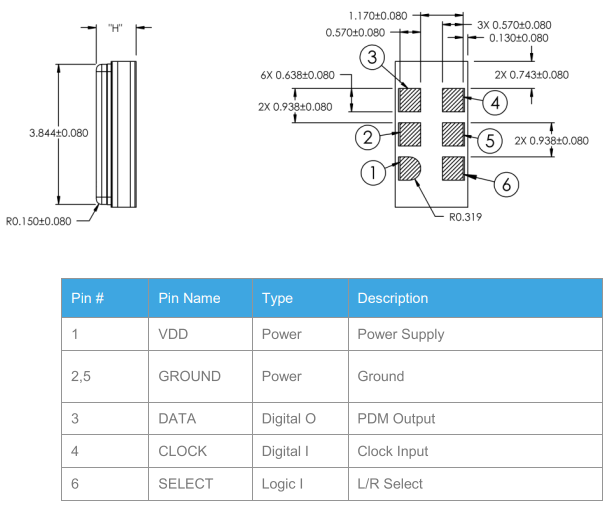

has a total of 6 pins, 3 of which are power-related with `SELECT` being connected to ground, leaving `DATA` and `CLOCK`.

note: if you're wondering why this is taking ages, documentation on octospi and making camera modules is hard to find :/ (decided to leave those for another time)

considering changing modems for gps tbh cos the LC76GABMD doenst support spi...

continuing tmr!!!

**total time spent: 1.6 hours**

# august 26: 2 hours of my life gone because of navigation, bluetooth, the economy, and bad planning

so apparently the LC76GABMD **does** support SPI and i was looking at an old piece of documentation the manufacturer never bothered to update lmao

with that said, i now have the option to connect it via I2C, UART or SPI, and i'll be choosing SPI for its data transfer speed

note: i've been looking for different modules (from the same manufacturer, i've taken a liking to their docs) that support bluetooth as well, problem is they all cost upwards of 50$ except this one module, the EG912UGLAC-I05-SNNSA for about 20$ however despite the features and decent price point, it's still overkill for this (i'll probably use it in a different project that would need it) so i'm going with the LC76GABMD and wait what *am* i using for bluetooth

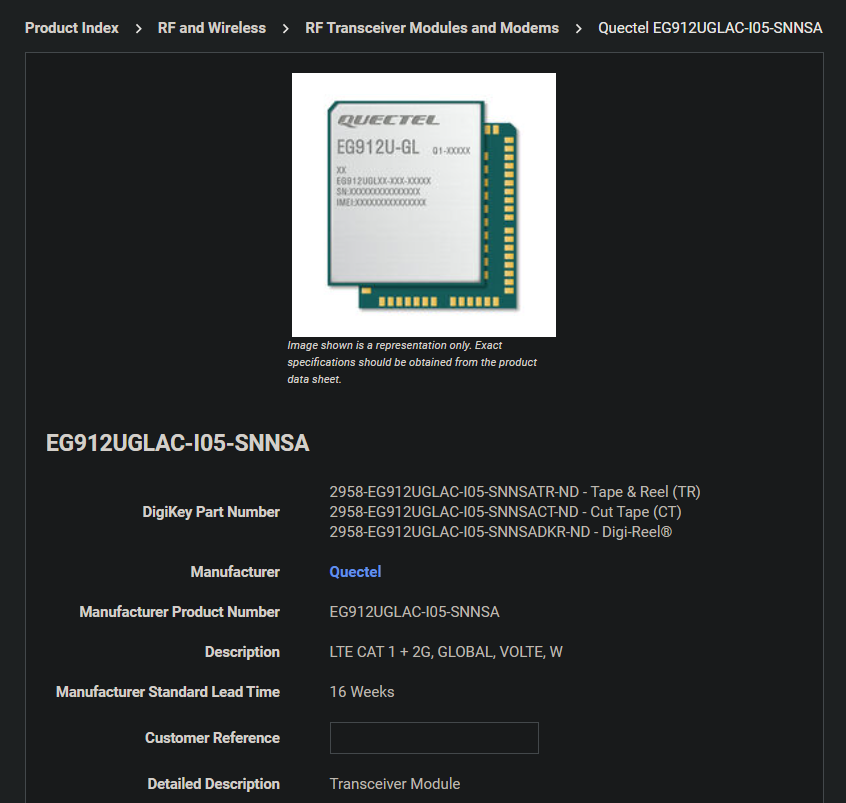

so apparently there are a couple of ways i could go about adding bluetooth support:
1. switching MCUs from a STM32U3C5 (low power) to a STM32WB (bluetooth and other wireless protocol) and connecting it directly to an antenna
2. adding a bluetooth to serial converter (the quality and reliability of which i highly doubt)
3. adding another bluetooth module on top of the already existing navigation one (i don't know if that's even supported, contacted quectel about that earlier today and their response times are atrocious)
4. switching modules to one that supports both natively (see note above)

still thinking about it...

on the plus side i found out an SD card reader can be set to use SPI so that's neat

**total time spent: 2 hours**

# august 27: progress is slowly being made :D

note: got carried away looking at stlink debuggers and decided it would be a good idea to design the debugging pins around the specifications for the STLINK-V3MINIE (note that the STLINK-V3MINI lacking an E is the obsolete version using the same board as the STLINK-V3MODS) so i can be ~~lazy and just plug it straight into my laptop~~ efficient

after weighing my options, i decided to go with...

~~the Adding Multiple Modules on Board™ route to save on cost. i chose the M66FB-03-STD module supporting bluetooth and cellular, i'll connect it to the MCU via UART~~ (sorry i have a problem with deciding on things within less than 1 business day lets hope i don't change this again) 

using the (maybe not so overkill) EG912UGLAC-I05-SNNSA to both solve my bluetoothless predicament and replace the LC76GABMD for navigation support

for the next hour i will attempt to understand the reference and hardware design .pdf(s) while deciding how i should connect it to the MCU! according to the spec sheet it supports the following interfaces: *inhales* (U)SIM, UART, USB 2.0, Digital Audio (PCM), Analog Audio, ADC, I2C, SPI, LCM, Camera, SD Card, and three antennae (woa)

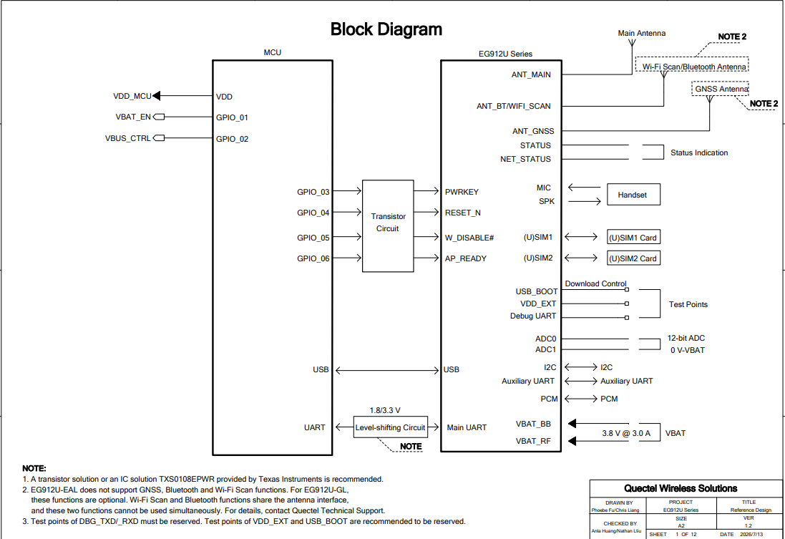

"wait did i just see aUdIo?!?!? and a cAmErA"

**total time spent: 2.3 hours**

# august 28: researched the STLINK-V3MINIE and reference designs

note: i was actually planning to try and finally understand what OCTOSPI is but i...

continued my getting carried away streak and looked at the datasheet for the STLINK-V3MINIE, apparently it uses the FTSH-107-01-L-DV-K-A connector in particular for connecting to boards via a STDC14 header

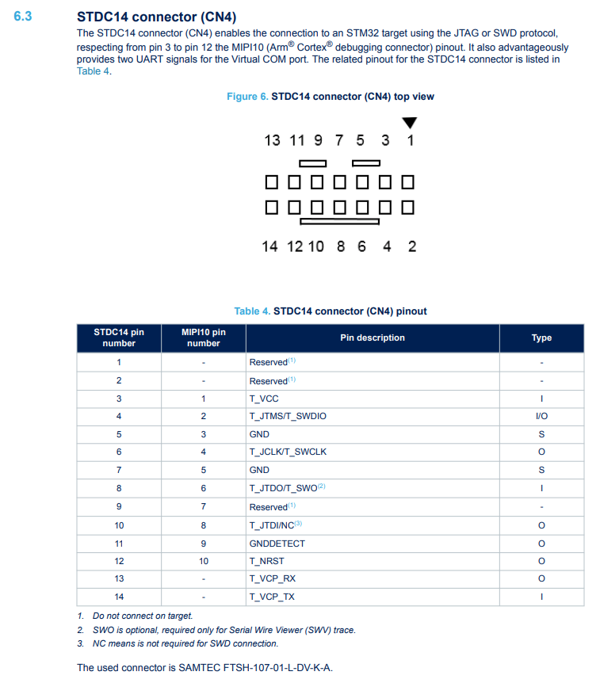

expertly demonstrating my electrical ineptitude, i then proceeded to decide to adapt stuff from the  NUCLEO-G474 thanks to this [stack overflow answer](https://electronics.stackexchange.com/a/649973)

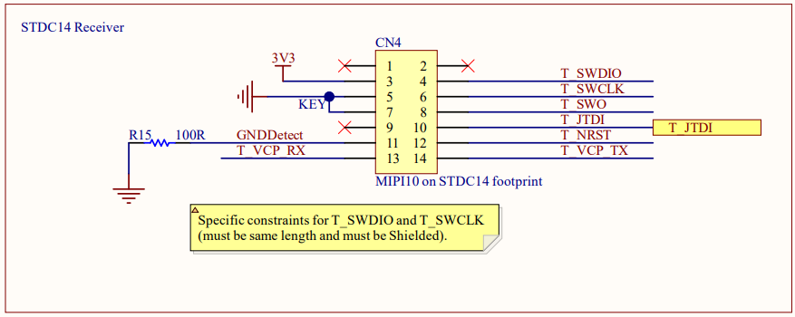

**total time spent: 1 hour**

# august 29: searching for a camera (and npu) that doesn't exist (or does it?)

after getting back on track to hopefully finally figure out how to arrange all the connections i'm currently looking for a camera!

my criteria for the camera module are primarily autofocus and mv

the autofocus should be simple enough: just get a camera module with motorized focus and either add a LIDAR to detect depth (overkill) or use an subject recognition algorithm and adjust focus according to subject sharpness

the MV, which im going to use for object detection and **potentially** other postprocessing stuff to make the saved media higher quality

i'll have to find a SoC or ASIC- ACTUALLY NVM i just found out that the STM32U3C5RIT6Q comes with a HSP i can offload some MV functions off onto saving me routing time and HC some money (win-win hehe)

note: i paused lookout for 10 mins :<

ok component finding time RAAAAAAWR >:3c

i am HIGHLY considering making my own camera module (i'll need to check my calendar for my exam dates later)

something that comes to mind is the raspberry pi camera module 3 but unfortunately the STM32U3C5RIT6Q doesnt support DCMI.

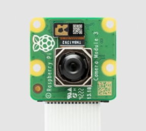

either way i just remembered i'll need to add some M3 standoffs to mount this above the main PCB 

actually un-nevermind my earlier nevermind, just found out that the MCU won't have enough processing power for MV so i might have to scrap that idea ;A; (or i might consider changing MCUs)

**total time spent: 1 hour**

# august 30: continuing the search for the ideal not a camera

note: lemme jst get somethin out of the way uhhh if anyone's gonna read this i started this at 11:45pm and pushed a commit a couple minutes after with the total hrs spent at 1 cos i didn't want to lose my streak >///< (it's recorded in lapse tho dw)!

~~now that i've (unfortunately) decided to scrap the onboard MV i'm gonna go with making my own camera module~~

decided to switch MCUs to a more capable processor (unfortunately axing the ultra low power capabilities of the STM32U3 series but oh well) right now i'm looking at either the 
 - STM32H7 series (bonus points for being included on one of my fave camera modules)
 - or the STM32N6 series cos they come with inbuilt NPUs (woaaa!!!) but they have crazy pin counts in a BGA format

gotta weigh my options so i don't go overkill with this (also considering time limits cos my exams are coming up TwT)

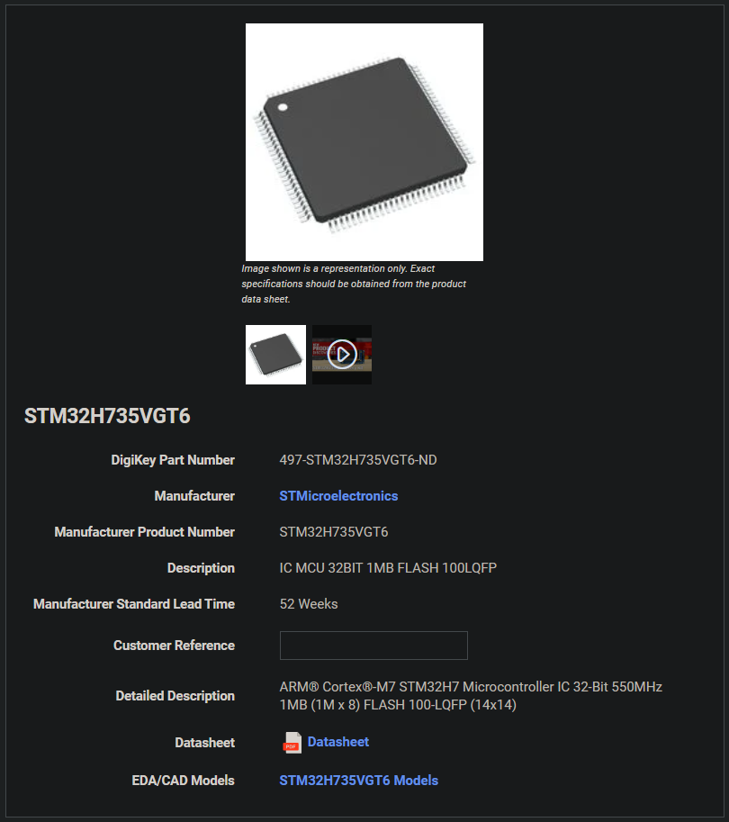

eventually decided on the STM32H735VG cos an NPU isn't worth going insane over attempting to route a VFBGA with 142 pins at minimum on just 4 layers (at least one of which will inevitably be a gnd plane)

fortunately, the STM32H735VG has support for DCMI so i'll be sticking with the raspberry pi camera module 3

unfortunately switching MCUs also means i now have to read through even more docs and rethink some of my earlier choices (you win some, you lose some lol)

**total time spent: 1.3 hours**

# august 31: fixing up the BOM

had to make an emergency change to the MCU (again) cos i forgot the STM32H735VG didn't have a JPEG codec peripheral, switched it to the STM32H7B3VIT6

to recap the BOM now includes the following:
1. STM32H7B3VIT6 (MCU)
2. MX25L3233FM2I-08G (external QSPI flash)
3. EG912UGLAC-I05-SNNSA (comms module)
4. 1575AT43A0040001E (GNSS antenna)
5. 2450AD18A6050002E (bluetooth antenna)
6. 0830AT54A2200001E (cellular antenna)
7. SPG08P4HM4H-1 (MEMS mic)
8. CLMVC-FKA-CL1D1L71BB7C3C3 (status led)
9. SC32S-7PF20PPM (LSE osc)
10. ECS-80-18-23B-JTN-TR (osc)
11. DM3AT-SF-PEJM5 (microSD conn)
12. SIM8051-6-0-14-01-A (microSIM conn)
13. FTSH-107-01-L-DV-K-A (debug conn)

as well as an additional

14. STLINK-V3MINIE (debugger, not on board)

will be making the camera module tmr!!!(similar to the openMV OV5640 FPC Camera Module stay tuned) eepy...

aforementioned items come to a rough

USD68.66 :D

**total time spent: 2.8 hours**

# september 1: stealing ST's ref designs and making ECAD models

so apparently i just found out that unlike the STM32U3C5RIT6Q the docs don't exactly come with a reference design and instead just point you to an eval/devboard :/

and i just remembered we need to get the component symbols :O

"gonna look for the symbols and footprints!", quote by me before i realized most online ECAD resources (except for the 3D models suck)

making my own footprints now, wish me luck!

~~## the STM32H7B3VIT6
so the STM32H7B3VIT6, as denoted by the V in its name stands for 100 pins/balls and the T for an LQFP package~~

just realized some of these components already have their symbols and footprints in the official kicad libraries uhhh
- [x] STM32H7B3VIT6 (MCU)
- [x] MX25L3233FM2I-08G (external QSPI flash)
- [ ] EG912UGLAC-I05-SNNSA (comms module)
- [ ] 1575AT43A0040001E (GNSS antenna)
- [ ] 2450AD18A6050002E (bluetooth antenna)
- [ ] 0830AT54A2200001E (cellular antenna)
- [ ] SPG08P4HM4H-1 (MEMS mic)
- [x] CLMVC-FKA-CL1D1L71BB7C3C3 (status led)
- [ ] SC32S-7PF20PPM (LSE osc)
- [ ] ECS-80-18-23B-JTN-TR (osc)
- [x] DM3AT-SF-PEJM5 (microSD conn)
- [ ] SIM8051-6-0-14-01-A (microSIM conn)
- [ ] FTSH-107-01-L-DV-K-A (debug conn)

so while looking for symbols for the EG912UGLAC-I05-SNNSA (non-existent btw) apparently kicad has an easter egg!

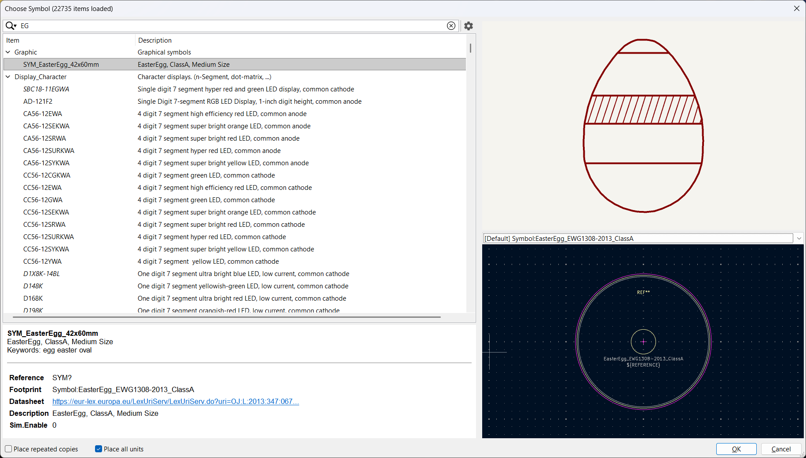 

(and its datasheet is a german document for the eu's agricultural products regulation 2013)

now moving on to actually making them:

## the EG912UGLAC-I05-SNNSA:

the footprint and the symbols were actually available on its [product page](https://www.quectel.com/product/lte-cat-1-bis-eg912u-gl) under hardware specs as a zip file with the footprint & part so now i just have to convert it into a kicad lib (for the record, i *almost* attempted to manually design one from its 2D dimensions file)

and after quite a while of figuring out why some random kicad functions didn't work it's finally done! :>

so just to put this down,

for the schematic and footprint:

1. opened the symbols (there were multiple units) and footprint in their respective editors, (however for the symbol i needed to manually import it in cos it wasn't a kicad file)
2. created and saved the symbols and footprint under a library by the same name

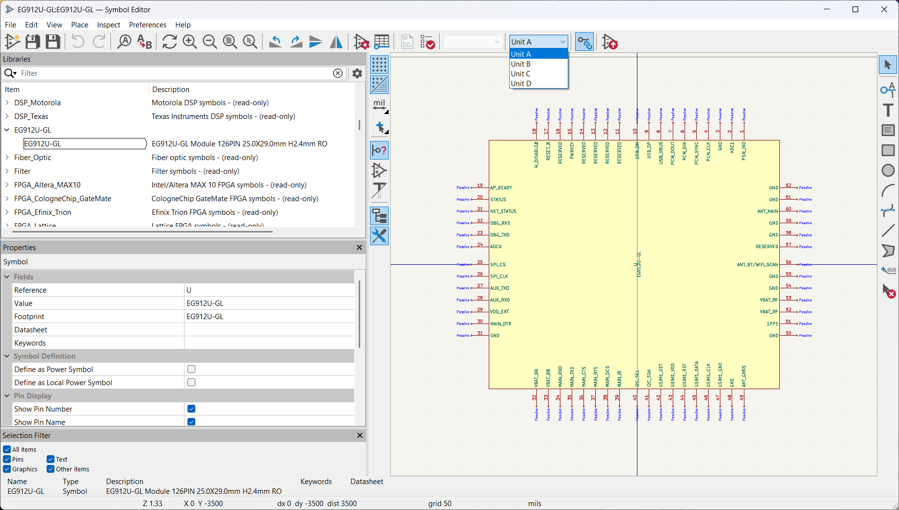
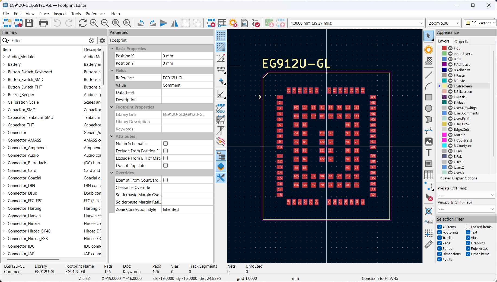

for the 3D model:

1. i saved the provided .sldasm as a .step and shoved it in the folder
2. connected it to the footprint and moved it to match their positions

note: i let kicad decide how to arrange the layers in the footprint, but i had to switch the stuff on the user.5 layer to the f.courtyard layer to avoid an error while saving the footprint after linking its 3D model

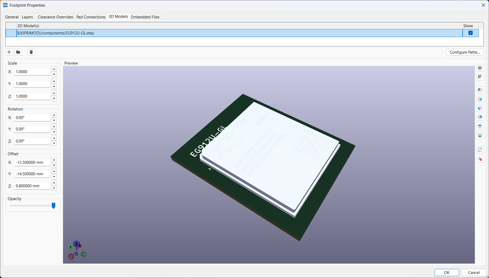

# the antennas (1575AT43A0040001E, 2450AD18A6050002E, 0830AT54A2200001E):

note: apparently most engineers use antennas (with the english pluralization -s) instead of antennae (with the latinate pluralization for it -ae)

this time around, i wasn't able to get any manufacturer-provided 3D models so we'll have to do without :<

however all 3 of these components are pretty basic SMDs with 2 pins, only varying in dimension

since kicad already includes symbols for pcb chip antennas, i'll just need to make the footprints by following their respective datasheets

however, looking at the symbols, to ensure that i follow kicad design rules i'm going to be using one of their generators following [this guide](https://gitlab.com/groups/kicad/libraries/-/wikis/Generators/Run-a-generator), but now there seems to be an issue cos i managed to track down 2 of the components in the kicad official libraries, namely the Johanson_2450AT18x100_2400-2500Mhz, Johanson_2450AT43F0100_2400-2500Mhz, which were generated with the [`SMD_2terminal_chip_molded`](https://gitlab.com/kicad/libraries/kicad-library-tools/-/tree/main/src/generators/SMD_2terminal_chip_molded) generator instead of the [`RF_chip_antenna`](https://gitlab.com/kicad/libraries/kicad-library-tools/-/tree/main/src/generators/RF_chip_antenna?ref_type=heads) generator

how odd...

managed to find the  history behind one of the aforementioned footprints, [its footprint commit](https://gitlab.com/kicad/libraries/kicad-footprints/-/commit/5c6d9d399ea63538d09524446daba99351a88d89), and [its generator input .yaml](https://gitlab.com/kicad/libraries/kicad-footprints/-/commit/5c6d9d399ea63538d09524446daba99351a88d89) ~~and i'm still unsure as to whether they were created with the wrong generator~~ literally right after i wrote this i looked at the commit dates and the antenna i just mentioned was created in 2020 while the `RF_chip_antenna` generator was made in 2025

ran `./generate.py -l` according to the generator guide and realized that `SMD_2terminal_chip_molded` makes footprints only and `RF_chip_antenna` makes 3D models only

right now my priority is getting (and learning how to make) the footprints, so i'll be using `SMD_2terminal_chip_molded` to get a couple of footprints

note: on the topic of generators, if you check out the datasheet for the 2450AD18A6050002E, and scroll to the bit about dimensions you'll notice that compared to the other antennas, this one has an extra dimension listed as `b` but this won't affect the footprints so i'm ignoring it lmao i just wasted about 5 mins of your time XD

created a .yaml in the components [folder here](components/antennas.yaml) adapted from [this commit](https://github.com/cnieves1/kicad-footprint-generator/blob/4583d5840302e15422bcefdb8015ca8986d507a7/scripts/SMD_chip_package_rlc-etc/size_definitions/size_Johanson_antenna_chip_devices.yaml) 

AND I JUST REALIZED I GOTTA PUSH BEFORE 11:59pm

**total time spent: 4.5 hours**