# august 21: got started and ...
started with making the README as all half-baked projects do and added the CERN-OHL to it :>


decided to research what i wanted to put in this (i.e. the features) and came up with a few things:
 - a push-to-talk mic for making voice memos
 - secondary SD card storage (also i just learned that UHS-II microSD cards exist)
 - periodic GPS
 - a camera (hence the name)
 - BLE positioning
 - a dot matrix display
 - replaceable battery packs

so far, the important parts i've mostly settled on are:
1. mic: SPG08P4HM4H-1
2. sd card connector: a DM3AT-SF-PEJM5 for microSD
3. gps:
    - chip antenna: 1575AT43A0040001E
    - modem: LC76GABMD (according to its datasheet it doesnt use much power)
4. camera: (on hold for now until i figure out whether i can use a module or i have to design one from scratch)

i'll figure the rest of the features out as i go along lol

i'm planning to also design (and hopefully 3D print) a couple of different enclosures to keep it attached on bag straps or on other stuff! still trying to think about how to solve the issue of this stuff not being used in *questionable* ways... 

for some of the features above dealing with sensitive data i could add data encryption but thats a story for another time

**total time spent: 2.5 hours**

# august 22: started work on the microcontroller!
started off looking up what microcontroller i should use,
some stuff that contributed to my final decision were
 - how power intensive it is
 - if it has enough gpios for all the features
 - cryptography support!!! (wouldn't want *questionable* things to happen to the recordings so i should be encrypting user data)

so i eventually decided on the STM32U3C5RI cos it checks off all the criteria listed above! i started reading stuff on it to understand what i was working with (datasheets, guides, random oddly helpful reddit posts, etc.)

unrelated, but i just realized i paused lookout for about 30 mins without noticing :/


i'm thinking of adding extra flash on top of the MCU's inbuilt stuff
i'll be referring to this tutorial [here](https://roboticworx.io/blogs/projects/build-custom-stm32s-from-scratch-tutorial) for some of the stuff (no i'm not going to copy it 1 to 1 relaaaaaaxxxxxxx)

i'm probably not going to add an onboard STlink debugger (yet)

so far i've learned about what goes into a devboard so i'll have to connect 
 - a voltage regulator (the MCU runs on 3.3V)
 - external OCTOSPI

**total time spent: 4.5 hours**

# august 23: schematics pt.1
note that this is chronologically immediately after the previous journal entry i just wanted to break them in two it is currently 12am something as of writing this

anyways b a c k to the journal entry!

ok here goes nothing i'm going to actually start making the wait can i just call this a glorified devboard bit (MCU, power regulator, flash, crystal - yknow the basic bits)

unrelated note: fell asleep at 1am here, woke up at 6 something

according to its [datasheet](https://www.st.com/resource/en/datasheet/stm32u3c5ci.pdf) (chapter 7, ordering info), the STM32U3C5RIT6 has 64 pins, comes in a LQFP (low-profile quad flat package), can stand temperatures of -40C to 85C, and does NOT have an SMPS (saving me the GPIOs and time cos this isn't an application where i'd need to optimize every mW)

also going to refer to [this](https://www.st.com/resource/en/application_note/an6011-getting-started-with-stm32u3-mcu-hardware-development-stmicroelectronics.pdf), specifically chapter 8, reference design, figure 13

got slightly carried away and switched the journal images from being hosted on github's user attachments to a local directory (`journal_images` in case you're looking for it)

i'm going to start off with this schematic (chapter 5, electrical characteristics, figure 23), showing what capacitors go where for its power supply specifically for the models without an SMPS


**it** happened again. 15 long minutes of not recording. TwT

also, note to self, make sure to check the contents of your commit before pushing to the repo blindly to avoid a 20min long headache fixing broken symbol and footprint paths

anyways following this, i did this (btw VDDIO and VREF in figure 23 don't apply for the STM32U3C5RIT6 cos it doesn't have those pins) to complete the power decoupling caps!

 


next i looked at adding an oscillator to it, following (chapter 5, electrical characteristics, figure 23), 


[the application note](https://www.st.com/resource/en/application_note/an2867-guidelines-for-oscillator-design-on-stm8afals-and-stm32-mcusmpus-stmicroelectronics.pdf)

i used an ECS-80-18-23B-JTN-TR 8MHz crystal for the oscillator and a SC32S-7PF20PPM 32.768kHz crystal for the LSE following the tutorial cos i didnt see a reason to change it


now this part's a little bit tricky: i have to decide what pins in particular i'm going to need to breakout, so that means returning to the feature list!!!

i'm going to stop here for now lol while i figure out the features, protocols, pins and stuff

**total time spent: 6.25 hours**

# august 25: schematics pt.2

back to work RAAAAAAAAWR

unrelated note: the stm website was down for several hours :<

to recap, the features i'm going to have to consider in the pinout are:
- mic
- camera
- flash memory
- GPS
- BLE
- microSD card interface 

the mems mic i'm using (SPG08P4HM4H-1)


has a total of 6 pins, 3 of which are power-related with `SELECT` being connected to ground, leaving `DATA` and `CLOCK`.

note: if you're wondering why this is taking ages, documentation on octospi and making camera modules is hard to find :/ (decided to leave those for another time)

considering changing modems for gps tbh cos the LC76GABMD doenst support spi...

continuing tmr!!!

**total time spent: 1.6 hours**

# august 26: 2 hours of my life gone because of navigation, bluetooth, the economy, and bad planning

so apparently the LC76GABMD **does** support SPI and i was looking at an old piece of documentation the manufacturer never bothered to update lmao

with that said, i now have the option to connect it via I2C, UART or SPI, and i'll be choosing SPI for its data transfer speed

note: i've been looking for different modules (from the same manufacturer, i've taken a liking to their docs) that support bluetooth as well, problem is they all cost upwards of 50$ except this one module, the EG912UGLAC-I05-SNNSA for about 20$ however despite the features and decent price point, it's still overkill for this (i'll probably use it in a different project that would need it) so i'm going with the LC76GABMD and wait what *am* i using for bluetooth


so apparently there are a couple of ways i could go about adding bluetooth support:
1. switching MCUs from a STM32U3C5 (low power) to a STM32WB (bluetooth and other wireless protocol) and connecting it directly to an antenna
2. adding a bluetooth to serial converter (the quality and reliability of which i highly doubt)
3. adding another bluetooth module on top of the already existing navigation one (i don't know if that's even supported, contacted quectel about that earlier today and their response times are atrocious)
4. switching modules to one that supports both natively (see note above)

still thinking about it...

on the plus side i found out an SD card reader can be set to use SPI so that's neat

**total time spent: 2 hours**

# august 27: progress is slowly being made :D

note: got carried away looking at stlink debuggers and decided it would be a good idea to design the debugging pins around the specifications for the STLINK-V3MINIE (note that the STLINK-V3MINI lacking an E is the obsolete version using the same board as the STLINK-V3MODS) so i can be ~~lazy and just plug it straight into my laptop~~ efficient

after weighing my options, i decided to go with...

~~the Adding Multiple Modules on Board™ route to save on cost. i chose the M66FB-03-STD module supporting bluetooth and cellular, i'll connect it to the MCU via UART~~ (sorry i have a problem with deciding on things within less than 1 business day lets hope i don't change this again) 

using the (maybe not so overkill) EG912UGLAC-I05-SNNSA to both solve my bluetoothless predicament and replace the LC76GABMD for navigation support

for the next hour i will attempt to understand the reference and hardware design .pdf(s) while deciding how i should connect it to the MCU! according to the spec sheet it supports the following interfaces: *inhales* (U)SIM, UART, USB 2.0, Digital Audio (PCM), Analog Audio, ADC, I2C, SPI, LCM, Camera, SD Card, and three antennae (woa)


"wait did i just see aUdIo?!?!? and a cAmErA"

**total time spent: 2.3 hours**

# august 28: researched the STLINK-V3MINIE and reference designs

note: i was actually planning to try and finally understand what OCTOSPI is but i...

continued my getting carried away streak and looked at the datasheet for the STLINK-V3MINIE, apparently it uses the FTSH-107-01-L-DV-K-A connector in particular for connecting to boards via a STDC14 header


expertly demonstrating my electrical ineptitude, i then proceeded to decide to adapt stuff from the  NUCLEO-G474 thanks to this [stack overflow answer](https://electronics.stackexchange.com/a/649973)


**total time spent: 1 hour**

# august 29: searching for a camera (and npu) that doesn't exist (or does it?)

after getting back on track to hopefully finally figure out how to arrange all the connections i'm currently looking for a camera!

my criteria for the camera module are primarily autofocus and mv

the autofocus should be simple enough: just get a camera module with motorized focus and either add a LIDAR to detect depth (overkill) or use an subject recognition algorithm and adjust focus according to subject sharpness

the MV, which im going to use for object detection and **potentially** other postprocessing stuff to make the saved media higher quality

i'll have to find a SoC or ASIC- ACTUALLY NVM i just found out that the STM32U3C5RIT6Q comes with a HSP i can offload some MV functions off onto saving me routing time and HC some money (win-win hehe)

note: i paused lookout for 10 mins :<

ok component finding time RAAAAAAWR >:3c

i am HIGHLY considering making my own camera module (i'll need to check my calendar for my exam dates later)

something that comes to mind is the raspberry pi camera module 3 but unfortunately the STM32U3C5RIT6Q doesnt support DCMI.


either way i just remembered i'll need to add some M3 standoffs to mount this above the main PCB 

actually un-nevermind my earlier nevermind, just found out that the MCU won't have enough processing power for MV so i might have to scrap that idea ;A; (or i might consider changing MCUs)

**total time spent: 1 hour**

# august 30: continuing the search for the ideal not a camera

note: lemme jst get somethin out of the way uhhh if anyone's gonna read this i started this at 11:45pm and pushed a commit a couple minutes after with the total hrs spent at 1 cos i didn't want to lose my streak >///< (it's recorded in lapse tho dw)!

~~now that i've (unfortunately) decided to scrap the onboard MV i'm gonna go with making my own camera module~~

decided to switch MCUs to a more capable processor (unfortunately axing the ultra low power capabilities of the STM32U3 series but oh well) right now i'm looking at either the 
 - STM32H7 series (bonus points for being included on one of my fave camera modules)
 - or the STM32N6 series cos they come with inbuilt NPUs (woaaa!!!) but they have crazy pin counts in a BGA format

gotta weigh my options so i don't go overkill with this (also considering time limits cos my exams are coming up TwT)


eventually decided on the STM32H735VG cos an NPU isn't worth going insane over attempting to route a VFBGA with 142 pins at minimum on just 4 layers (at least one of which will inevitably be a gnd plane)

fortunately, the STM32H735VG has support for DCMI so i'll be sticking with the raspberry pi camera module 3

unfortunately switching MCUs also means i now have to read through even more docs and rethink some of my earlier choices (you win some, you lose some lol)

**total time spent: 1.3 hours**

# august 31: fixing up the BOM

had to make an emergency change to the MCU (again) cos i forgot the STM32H735VG didn't have a JPEG codec peripheral, switched it to the STM32H7B3VIT6

to recap the BOM now includes the following:
1. STM32H7B3VIT6 (MCU)
2. MX25L3233FM2I-08G (external QSPI flash)
3. EG912UGLAC-I05-SNNSA (comms module)
4. 1575AT43A0040001E (GNSS antenna)
5. 2450AD18A6050002E (bluetooth antenna)
6. 0830AT54A2200001E (cellular antenna)
7. SPG08P4HM4H-1 (MEMS mic)
8. CLMVC-FKA-CL1D1L71BB7C3C3 (status led)
9. SC32S-7PF20PPM (LSE osc)
10. ECS-80-18-23B-JTN-TR (osc)
11. DM3AT-SF-PEJM5 (microSD conn)
12. SIM8051-6-0-14-01-A (microSIM conn)
13. FTSH-107-01-L-DV-K-A (debug conn)

as well as an additional

14. STLINK-V3MINIE (debugger, not on board)

will be making the camera module tmr!!!(similar to the openMV OV5640 FPC Camera Module stay tuned) eepy...

aforementioned items come to a rough


USD68.66 :D

**total time spent: 2.8 hours**

# september 1: stealing ST's ref designs and making ECAD models

so apparently i just found out that unlike the STM32U3C5RIT6Q the docs don't exactly come with a reference design and instead just point you to an eval/devboard :/

and i just remembered we need to get the component symbols :O

"gonna look for the symbols and footprints!", quote by me before i realized most online ECAD resources (except for the 3D models suck)

making my own footprints now, wish me luck!

~~## the STM32H7B3VIT6
so the STM32H7B3VIT6, as denoted by the V in its name stands for 100 pins/balls and the T for an LQFP package~~

just realized some of these components already have their symbols and footprints in the official kicad libraries uhhh
- [x] STM32H7B3VIT6 (MCU)
- [x] MX25L3233FM2I-08G (external QSPI flash)
- [ ] EG912UGLAC-I05-SNNSA (comms module)
- [ ] 1575AT43A0040001E (GNSS antenna)
- [ ] 2450AD18A6050002E (bluetooth antenna)
- [ ] 0830AT54A2200001E (cellular antenna)
- [ ] SPG08P4HM4H-1 (MEMS mic)
- [x] CLMVC-FKA-CL1D1L71BB7C3C3 (status led)
- [ ] SC32S-7PF20PPM (LSE osc)
- [ ] ECS-80-18-23B-JTN-TR (osc)
- [x] DM3AT-SF-PEJM5 (microSD conn)
- [ ] SIM8051-6-0-14-01-A (microSIM conn)
- [ ] FTSH-107-01-L-DV-K-A (debug conn)

so while looking for symbols for the EG912UGLAC-I05-SNNSA (non-existent btw) apparently kicad has an easter egg!

 

(and its datasheet is a german document for the eu's agricultural products regulation 2013)

now moving on to actually making them:

## the EG912UGLAC-I05-SNNSA:

the footprint and the symbols were actually available on its [product page](https://www.quectel.com/product/lte-cat-1-bis-eg912u-gl) under hardware specs as a zip file with the footprint & part so now i just have to convert it into a kicad lib (for the record, i *almost* attempted to manually design one from its 2D dimensions file)

and after quite a while of figuring out why some random kicad functions didn't work it's finally done! :>

so just to put this down,

for the schematic and footprint:

1. opened the symbols (there were multiple units) and footprint in their respective editors, (however for the symbol i needed to manually import it in cos it wasn't a kicad file)
2. created and saved the symbols and footprint under a library by the same name


for the 3D model:

1. i saved the provided .sldasm as a .step and shoved it in the folder
2. connected it to the footprint and moved it to match their positions

note: i let kicad decide how to arrange the layers in the footprint, but i had to switch the stuff on the user.5 layer to the f.courtyard layer to avoid an error while saving the footprint after linking its 3D model


## the antennas (1575AT43A0040001E, 2450AD18A6050002E, 0830AT54A2200001E):

note: apparently most engineers use antennas (with the english pluralization -s) instead of antennae (with the latinate pluralization for it -ae)

this time around, i wasn't able to get any manufacturer-provided 3D models so we'll have to do without :<

however all 3 of these components are pretty basic SMDs with 2 pins, only varying in dimension

since kicad already includes symbols for pcb chip antennas, i'll just need to make the footprints by following their respective datasheets

however, looking at the symbols, to ensure that i follow kicad design rules i'm going to be using one of their generators following [this guide](https://gitlab.com/groups/kicad/libraries/-/wikis/Generators/Run-a-generator), but now there seems to be an issue cos i managed to track down 2 of the components in the kicad official libraries, namely the Johanson_2450AT18x100_2400-2500Mhz, Johanson_2450AT43F0100_2400-2500Mhz, which were generated with the [`SMD_2terminal_chip_molded`](https://gitlab.com/kicad/libraries/kicad-library-tools/-/tree/main/src/generators/SMD_2terminal_chip_molded) generator instead of the [`RF_chip_antenna`](https://gitlab.com/kicad/libraries/kicad-library-tools/-/tree/main/src/generators/RF_chip_antenna?ref_type=heads) generator

how odd...

managed to find the  history behind one of the aforementioned footprints, [its footprint commit](https://gitlab.com/kicad/libraries/kicad-footprints/-/commit/5c6d9d399ea63538d09524446daba99351a88d89), and [its generator input .yaml](https://gitlab.com/kicad/libraries/kicad-footprints/-/commit/5c6d9d399ea63538d09524446daba99351a88d89) ~~and i'm still unsure as to whether they were created with the wrong generator~~ literally right after i wrote this i looked at the commit dates and the antenna i just mentioned was created in 2020 while the `RF_chip_antenna` generator was made in 2025

ran `./generate.py -l` according to the generator guide and realized that `SMD_2terminal_chip_molded` makes footprints only and `RF_chip_antenna` makes 3D models only

right now my priority is getting (and learning how to make) the footprints, so i'll be using `SMD_2terminal_chip_molded` to get a couple of footprints

note: on the topic of generators, if you check out the datasheet for the 2450AD18A6050002E, and scroll to the bit about dimensions you'll notice that compared to the other antennas, this one has an extra dimension listed as `a` (not the same with the other `a`s where their `a` is this one's `b`) but this won't affect the footprints so i'm ignoring it lmao i just wasted about 5 mins of your time XD

AND I JUST REALIZED I GOTTA PUSH BEFORE 11:59pm

ok back to work finally (just rushed to push and forgot to both include images and i also accidentally split the journal entry into 2 by making this section's header a h1 instead of a h2)

just going to leave the links to their datasheets here for convenience: [1575AT43A0040001E datasheet](https://www.johansontechnology.com/docs/4411/Antenna-1575AT43A0040001E.pdf), [2450AD18A6050002E datasheet](https://www.johansontechnology.com/docs/4892/Antenna-2450AD18A6050002E.pdf), [0830AT54A2200001E datasheet](https://www.johansontechnology.com/docs/3908/Antenna-0830AT54A2200001E-Rev3.0.pdf)

ok so after screwing around with the generator CLI for a while, here's my (not definitive) guide on how to generate custom symbols with the `SMD_2terminal_chip_molded` generator for idiots like me! (please don't come after me kicad devs)

1. clone the [kicad library tools](https://gitlab.com/kicad/libraries/kicad-library-tools/) repo somewhere, for the purposes of this i just shoved it into my home folder and didn't bother to change the folder name so it's at `~/kicad-library-tools` if you put it somewhere else go ahead and keep that in mind in regards to the paths and commands here

2. follow the [setup guide](https://gitlab.com/groups/kicad/libraries/-/wikis/Generators/Setup) and skip installing the relevant 3D packages stuff as well as configuring the git repo

4. modify `~/kicad-library-tools/data/SMD_2terminal_chip_molded/antenna_chip.yaml` with your favorite editor and replace it with [this antenna_chip.yaml](components/antenna_chip.yaml) instead where i just inserted the size specs for the 3 antennas this project uses

some of the following steps have been adapted (aka stolen) from the how to [run a generator guide](https://gitlab.com/groups/kicad/libraries/-/wikis/Generators/Run-a-generator) (if you're a lil dense like me that means read the stuff at the bottom not follow the guide)

5. change your directory to the generators dir with

    ```bash
    cd src/generators
    ```

6. run this line over here

    ```bash
    ./generate.py -f ~/snap/components/stuff -g SMD_2terminal_chip_molded
    ```

    where `-f` specifies the output path for the generated footprints (here's a warning that this line will generate a bunch of other components in that folder besides the antennas btw), and `-g` specifies the generator to be executed

7. once the folder's been generated, navigate to the `RF_Antenna.pretty` folder in it and extract the 3 antennas (`Johanson_0830AT54A2200001E.kicad_mod`, `Johanson_1575AT43A0040001E.kicad_mod`, and `Johanson_2450AD18A6050002E.kicad_mod`) and absolutely NUKE all the other junk

and there you have it, generated antennas :3

**total time spent: 6.5 hours**

# september 2: making even more ECAD models

note: i changed the mic to a MMICT5848-00-012 mic cos it supports I2S, also the docs for the ECS-80-18-23B-JTN-TR were little more than an afterthought

## the MMICT5848-00-012:

unlike the previous components, this one does NOT come with a manufacturer-provided symbol or footprint so i'll have to follow [the datasheet](https://mm.digikey.com/Volume0/opasdata/d220001/medias/docus/8902/MMMICT5848-00-012.pdf) and *actually* make my own... (hey, at least the docs are good)

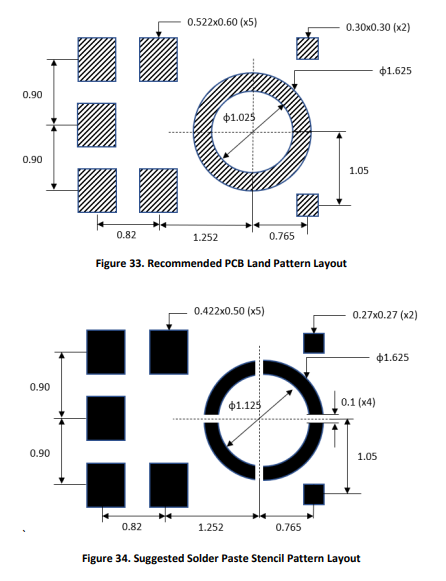
(chapter 9, PCB design and land pattern layout, figures 33 and 34)

note: thinking about its actual placement, i might make a flex PCB to mount this on and connect to the main board instead for better audio quality

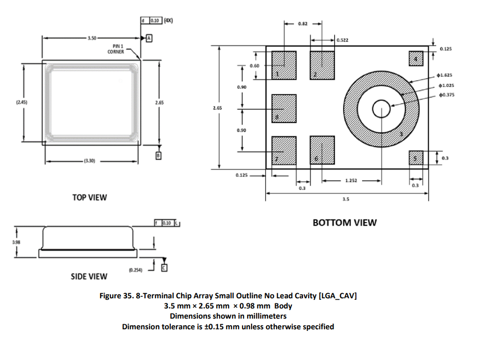
(chapter 11, outline dimensions, figure 35)

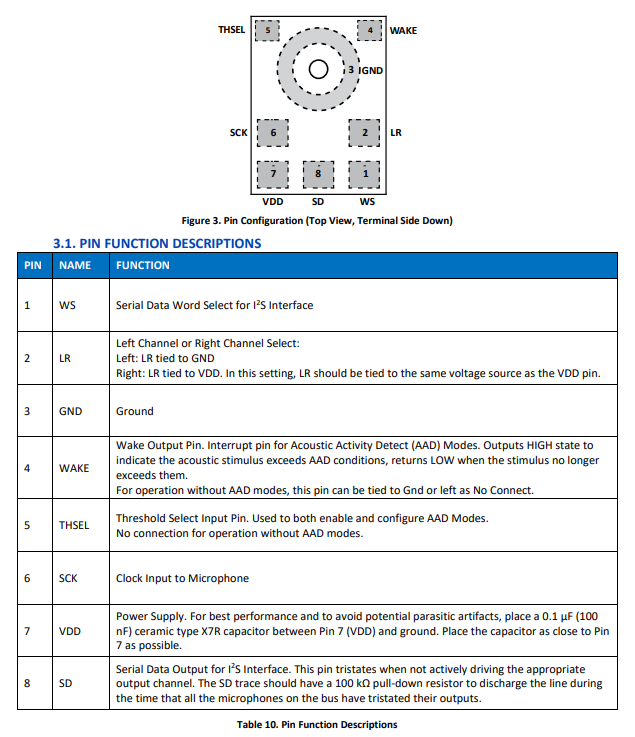
(chapter 3, pin configurations and function descriptions)

btw i based my footprint design off of one of the kicad library's other MEMS mics

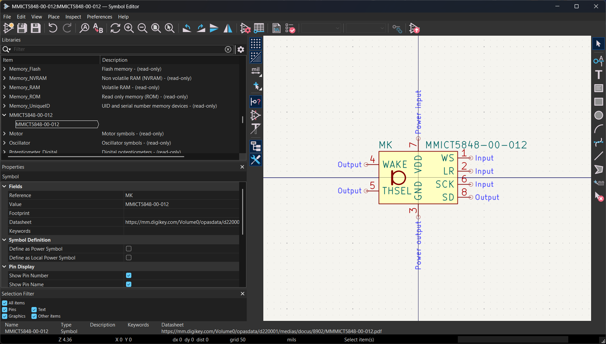

now it's time for the footprint!

actually i'll do this later lol

**total time spent: 1 hour**

# september 2: making even more ECAD models pt.2

just realized i paused lookout for 20 mins...

## the MMICT5848-00-012 (continued): 

anyways, i learned the footprint requires a couple of main things:

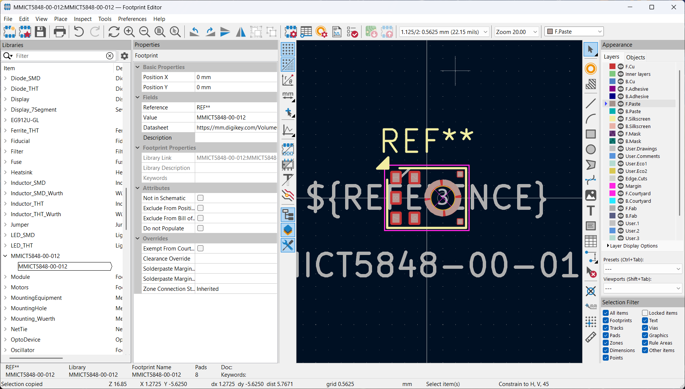

the pads, in this case all except 3 were SMD, with 3 being THT for the mic's sound hole

the solder paste layer is all according to the datasheet, except i couldn't figure out how to make the broken ring pads around pad 3, so i used the inner and outer diameters  and made 4 80deg arcs instead

the [courtyard](https://klc.kicad.org/footprint/f5/f5.3.html), [fab](https://klc.kicad.org/footprint/f5/f5.2.html) and [silkscreen](https://klc.kicad.org/footprint/f5/f5.1.html) layers are made according to the kicad KLC rules (to the best of my ability)

## the oscillators (SC32S-7PF20PPM, ECS-80-18-23B-JTN-TR): 

the oscillators also have non-part-specific symbols in the kicad library, `Crystal` and `Crystal_GND24` respectively

so it's just a matter of designing the footprints for them!

datasheets here for convenience: [SC32S-7PF20PPM](https://mm.digikey.com/Volume0/opasdata/d220001/medias/docus/7329/SC-32S.pdf), [ECS-80-18-23B-JTN-TR](https://ecsxtal.com/store/pdf/ecx_64r.pdf)

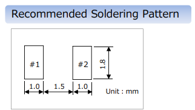

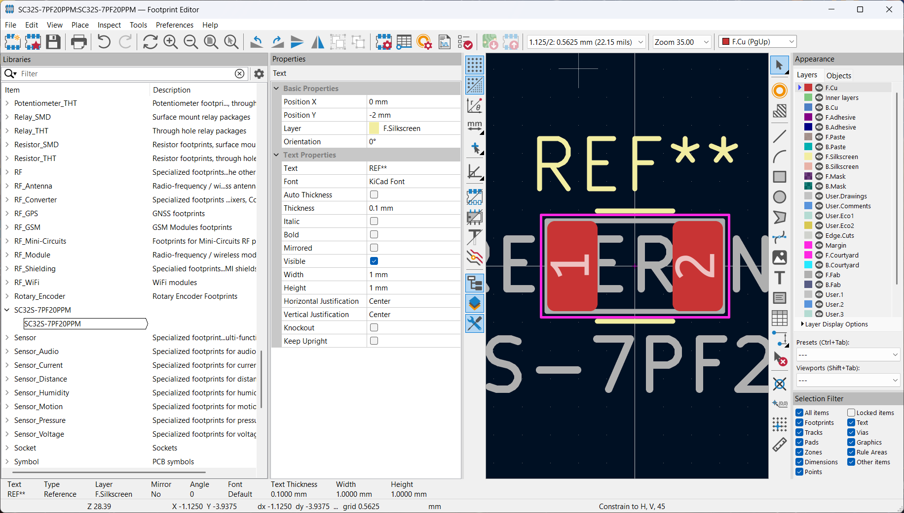

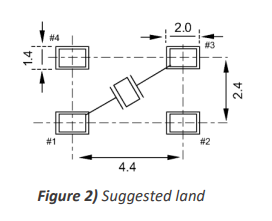

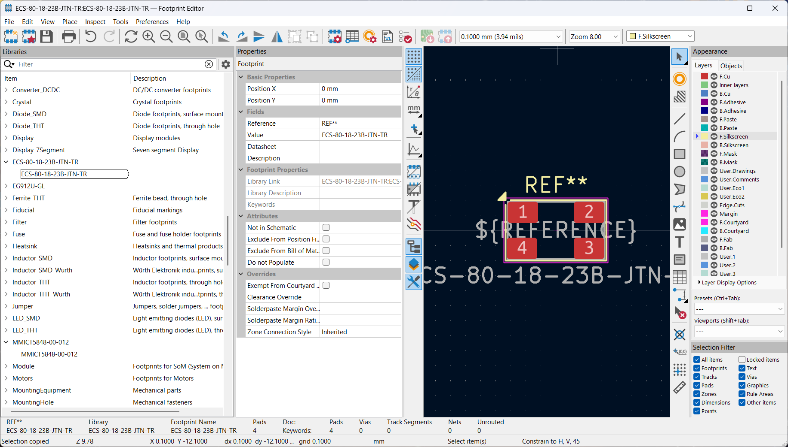

## the SF72S006VBDR2500:

note: also changed up the nano SIM connector because the SIM8051-6-0-14-01-A doesn't have a card detecting switch (also up to this entry i appear to have mixed up the micro and nano SIM sizes)

and it's already available with a symbol and footprint in the kicad libraries as `JAE_SIM_Card_SF72S006`

yay less work for me :3

## the FTSH-107-01-L-DV-K-A:

the FTSH-107-01-L-DV-K-A comes with a manufacturer-provided 3D model whose generator, which i've just noticed, is also powered by cadenac (the exact same as the sim connector i originally intended to use)

and now i'm getting tired of making footprints (rly wanna get back to making the actual schematic) so im just downloading it off of snapmagic (if it helps, samtec explicitly advertises it so...)

however, although snapmagic also provides a symbol for it, i'll be using one of the kicad connector symbols instead

**total time spent: 3.4 hours**

# september 2: actually starting to do the schematics with all these new parts

just to recap, (and to make sure i don't use the wrong parts) the BOM for the onboard components now includes the following:

1. STM32H7B3VIT6 (MCU)
2. MX25L3233FM2I-08G (external QSPI flash)
3. EG912UGLAC-I05-SNNSA (comms module)
4. 1575AT43A0040001E (GNSS antenna)
5. 2450AD18A6050002E (bluetooth antenna)
6. 0830AT54A2200001E (cellular antenna)
7. ~~SPG08P4HM4H-1~~ now MMICT5848-00-012 (MEMS mic)
8. CLMVC-FKA-CL1D1L71BB7C3C3 (status led)
9. SC32S-7PF20PPM (LSE osc)
10. ECS-80-18-23B-JTN-TR (osc)
11. DM3AT-SF-PEJM5 (microSD conn)
12. ~~SIM8051-6-0-14-01-A~~ now SF72S006VBDR2500 (microSIM conn)
13. FTSH-107-01-L-DV-K-A (debug conn)

i'm missing stuff like voltage regulators and USBC connectors but i'll just try my best to use parts with kicad symbols and footprints for them

## bare minimum stuff for the MCU:

note: i'm still referring to [this tutorial](https://roboticworx.io/blogs/projects/build-custom-stm32s-from-scratch-tutorial) as well as [this](https://embeddedprojects101.com/design-a-battery-powered-stm32-board-with-usb/)

first order of business: decoupling caps

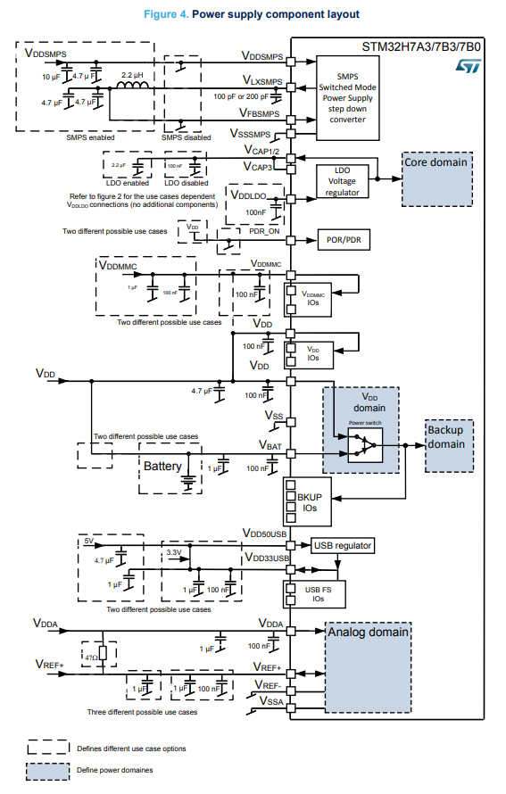

following the 

**total time spent: 0.5 hours**

# september 3: actually starting to do the schematics pt.2

note: i'm pushing this thing early to save my streak cos im on the road and my laptop WILL die soon (dw i'll actually do this later) 

please enjoy this picture of a cat at a gas station while waiting for the actual work to get done


IM BACK (btw i started at about 11:30pm)

### the decoupling caps:

ok so referring to the diagram above (prev entry), the SMPS stuff is unrelated (this specific MCU doesn't have one, also it was out of stock)

note that all decoupling caps have to be as close as possible to their respective pins

i'm wiring the VCAP pins to a 2.2uF cap, "LDO enabled or disabled: 100 nF close to each VCAPx pin, VCAPx connected together."

VDD50USB, VDD33USB not present

VREF- also unavailable, and i quote, "VREF+ input is not available on all package (refer to Table 1. STM32H7B3xI features and peripheral counts)
whereas VREF– is available only on UFBGA176+25, TFBGA225 with SMPS and TFBGA216. When VREF- is
not available, it is internally connected to VSSA." (thanks ST)

PDR_ON not present

note: felt the amount of caps was off and realized i started at the second page of the cap specs

for the VDD pins, "100 nF ceramic, for each VDD as close as possible to the pins. A 4.7 μF ceramic connected to one of the VDD pins." which can be summarized as n x 100nF + 4.7uF where n is the amount of VDDs the MCU has! this one has 5 so you can do the math

VREF+, VDDA, and VBAT just need a 1uF and a 100nF

VDDMMC, VDDSMPS, VLXSMPS, VFBSMPS, VDD not present

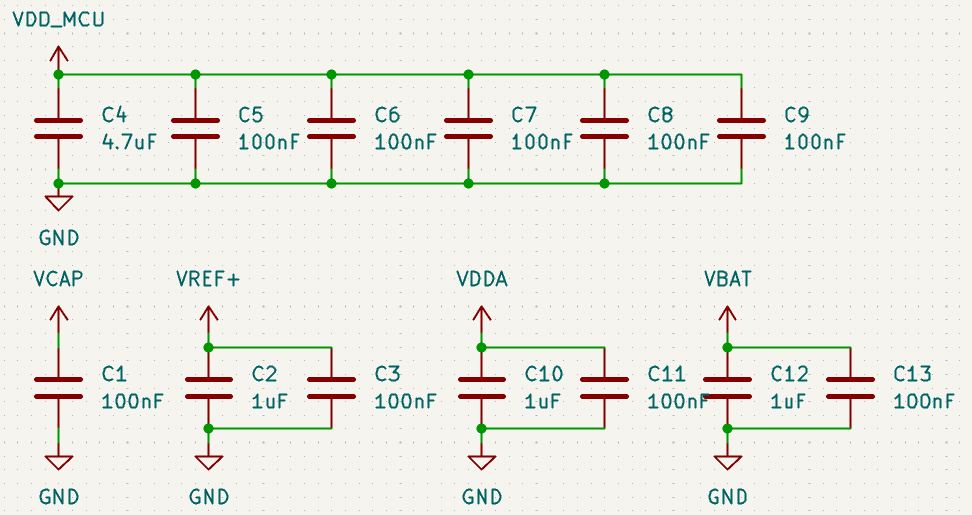

(honestly a lot less than i thought there'd be)

### the clocks:

the STM32H7B3VIT6 supports up to 4 clocks, an internal HSE and LSE, and their external counterparts, however due to the internal oscillators' questionable accuracy (especially with tasks that can cause the MCU to heat up drastically) i'll be opting to use the external ones exclusively

i'll be using a 8MHz crystal for the HSE, and a 
32.768kHz crystal for the LSE

the pinout has PH0 as OSC_IN, PH1 as OSC_OUT, PC14 as OSC32_IN (but it says OSC32_ON in the datasheet, most likely a typo), and PC15 as OSC32_OUT

as for the caps, according to [this article](https://support.microchip.com/s/article/Calculating-crystal-load-capacitor), "Assuming the same value is used for C1 and C2... : C1 = C2 = 2 * (CL – Cstray)", and, "Cstray... is often approximated as 5pF."

with those values and also looking at the datasheets for both the caps ([SC32S-7PF20PPM](https://mm.digikey.com/Volume0/opasdata/d220001/medias/docus/7329/SC-32S.pdf), [ECS-80-18-23B-JTN-TR](https://ecsxtal.com/store/pdf/ecx_64r.pdf)), the CL for the 8MHz crystal is anywhere between 6-12.5pf, and the 32.768kHz one is from 10-20pF

i'll be going with 10pF for the first cap and 20pF for the second, doing the math leaves us with the values: 10pF, and 30pF respectively (totally didn't steal this from the guide hehe)

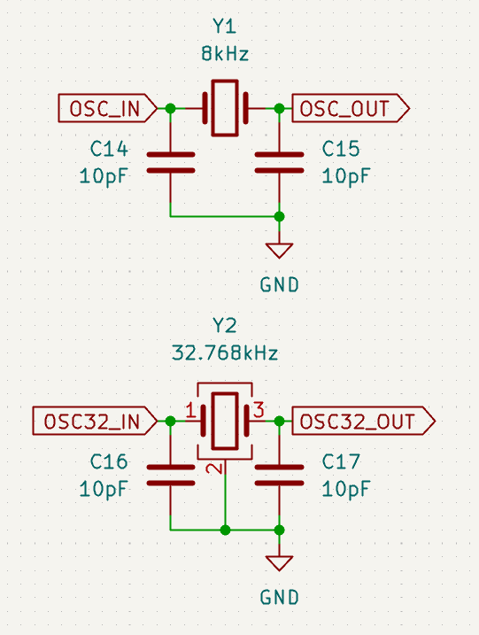

### the STDC14 connector

i'll be using the `Conn_02x07_Odd_Even` symbol for this!


according to the STLINK-V3MINIE pinout (and the MB1363 nucleo devboard schematics), 

- pins 1, 2, and 9 are reserved
- pin 3 is for VCC
- pins 5 and 7 are both for GND
- pin 4 is for SWDIO
- pin 6 is for SWCLK
- pin 8 is for SWO
- pin 10 is for JTDI
- pin 12 is for

will continue later

**total time spent: 2.22 hours**

# september 4: actually starting to do the schematics pt.3

### the STDC14 connector (continued)

- pin 11 is for GNDDETECT (it has to also be grounded as well apparently)
- pin 12 is for NRST
- pins 13 and 14 are for Rx and Tx respectively

note: i just found out apparently the STLINK-V3MINIE uses a STM32F723 MCU which imo is really overkill for a debugger

i'm also using an ESD on the connector pins to make sure my board stays functional (i don't have the best track record with electronics in general)

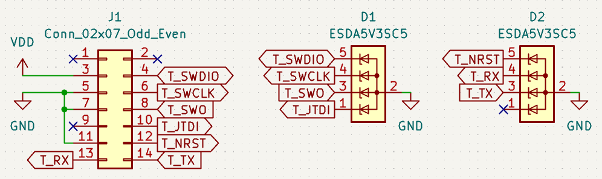

the MCU has a couple of specialized pins for this exact purpose too btw

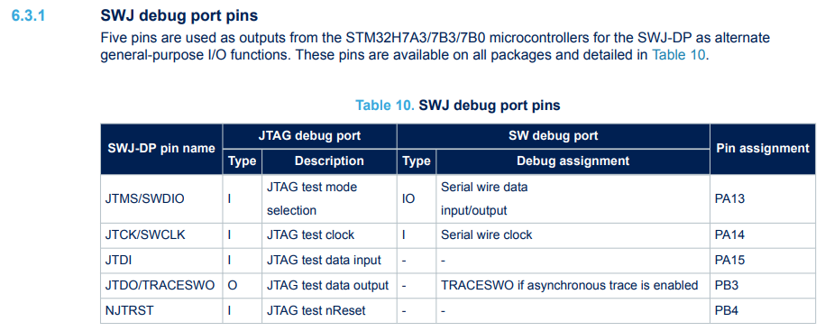

**total time spent: 1 hour**

# september 5: actually starting to do the schematics pt.4

## the boot and reset buttons

i'm using the PTS526SM15SMTR2 LFS for both buttons and that means i'll be making the footprints for them

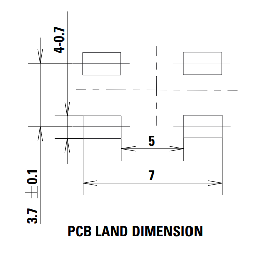

very angry note: also, whoever made the dimensions here needs to be fired. what on earth is a "4-0.7". that is not standard notation. the very first result thane i looked up "number minus number datasheet dimension" was a [stack exchange question](https://electronics.stackexchange.com/q/450137) asking the exact same thing about this specific datasheet.

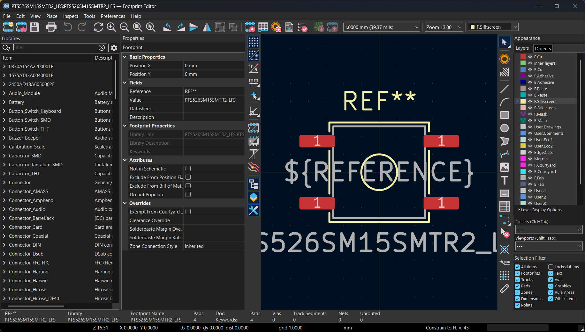

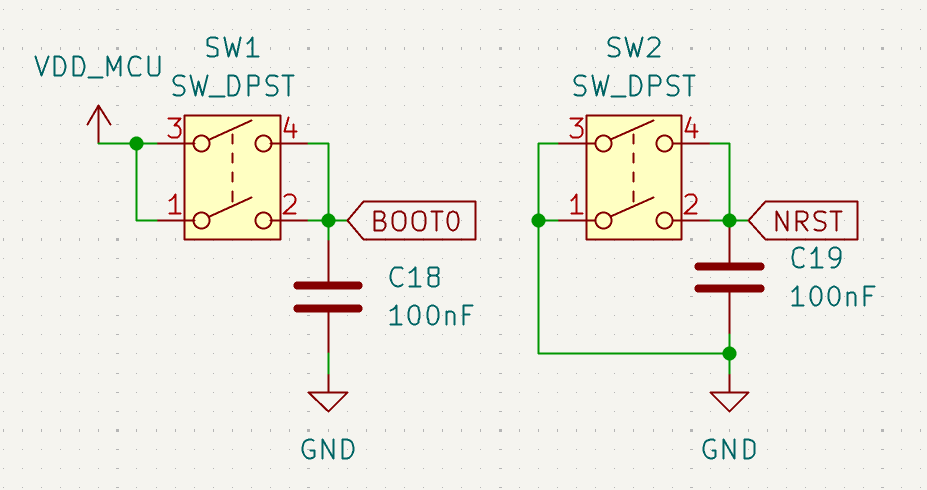

will continue later

**total time spent: 1.15 hours**

# september 6: actually starting to do the schematics pt.5

note: so apparently i was busy for a day or so and later actually just means tomorrow...

### the RGB LED

for this i'm going to be using the LED with transistors to hook the led up to vdd, they need pulldown resistors as well

got carried away and attempted to use the STM32CubeMX IDE to partially configure the pins to breakout, then my laptop decided to forget to turn its backlight back on after i had it go to sleep for some reason

here they are so far: 

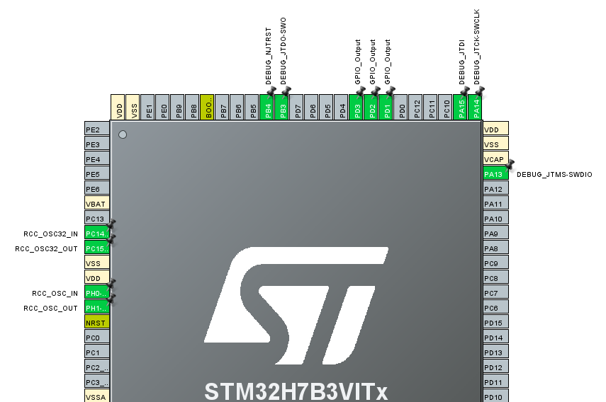

anyways

back to the RGB LED, well shit i didnt save now i gotta redo this 

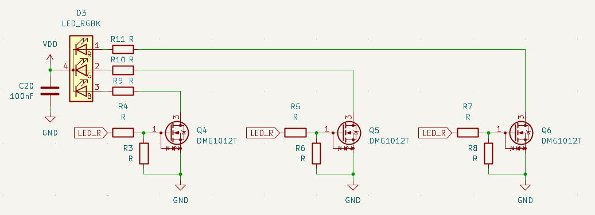

not done with the resistor values, will continue after pushing to save my streak

**total time spent: 1.1 hours**

# september 7: actually starting to do the schematics pt.6

note: pushing early to save my streak, apparently my laptop HAS to reinstall windows or something...

alright i'm back!!! (it's 10:50 rn)

### the RGB LED (continued)


note: here i decided to split the schematic into multiple sheets, so far i have 

1. the main sheet
2. MCU power
3. MCU peripherals (clocks, LED)
4. STLINK connector

besides this i also attempted to learn how to do hierarchical schematics in kicad

**total time spent: 1 hour**

# september 8: small schematic hiatus

note: pushing early cos i forgot the time (i think this is gonna be routine from now on, classes are eating away at my time, the only free time i have is past 11pm, no schematic work today i was too tired for that)

started 11:50 so i mean this should count right

just researched some stuff on how battery management works and how to power the MCU

i'll be separating the battery management module from the main board, bringing the total board count to 3: the main PCB, the camera module and the battery management module

read [this guide to power supply design](https://wiki.st.com/stm32mcu/wiki/Basics_of_power_supply_design_for_MCU) by ST

helpful note: the [solutions page](https://wiki.st.com/stm32mcu/wiki/Solutions) on the ST wiki's just really helpful in general, if you're also trying to learn STM32 MCU dev plz read that as well as the datasheet and getting started documents for your MCU

my requirements for the battery module are that it holds one cell (preferably a LiPo if i can source one), it can charge by connecting b2b to the USB-C connector on the main board

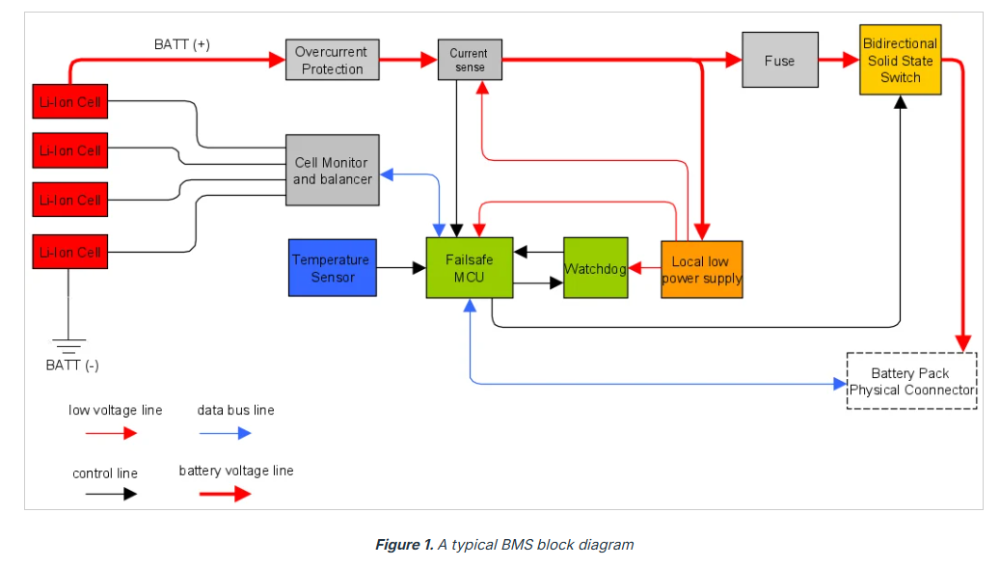

diagram stolen from [here](https://www.allaboutcircuits.com/technical-articles/introduction-to-battery-management-systems/)

note 1: just realized i forgot to turn lapse on so i KNOW this is gonna get deflated 

note 2: weird commit time cos i went to sleep after forgetting to push

**total time spent: 1.5 hours**

# september 9: actually starting to do the schematics pt.7

taking a break from the MCU related stuff, time to move on to comms!

## communication stuff: 

all the communication stuff here's based off of the EG912UGLAC-I05-SNNSA, developer resources [here](https://developer.quectel.com/en/modules-cat/eg912u-series) 

wait.

well shit apparently i can't read.

ok uhhh apparently the EG912UGLAC-I05-SNNSA doesn't support GNSS or BT and the docs were actually referring to the EG912UGLAA... welp time to look for another cos even the EG912UGLAA is completely out of stock everywhere

decided to axe BT and switch to the BG95-MF 

so... now i have to go through extracting the footprint and symbol (i'll leave the prev EG912U-GL models here for future use)

i followed the exact same steps
as i did for the EG912UGLAC-I05-SNNSA except the .step file was provided

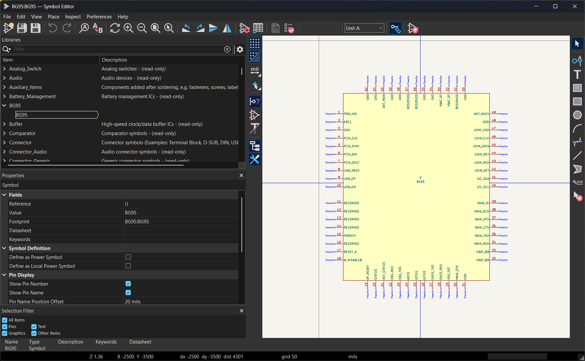

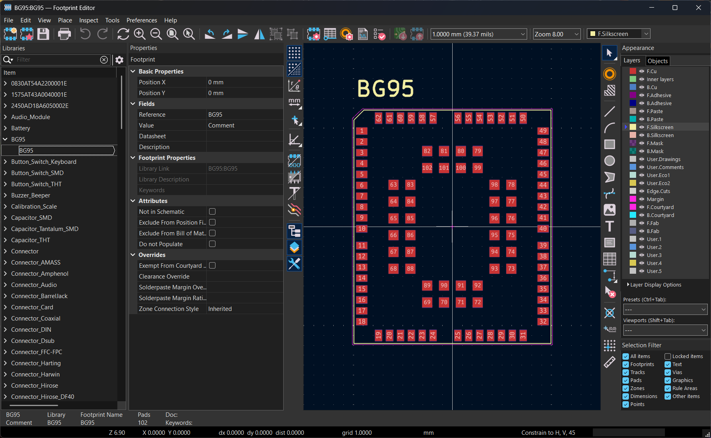

note: a couple hours later i realized that kicad already has a symbol and footprint for that, ended up replacing the footprint i extracted with a copy of the kicad one and just added the manufacturer-provided 3D model to it, however i kept the extracted symbol 

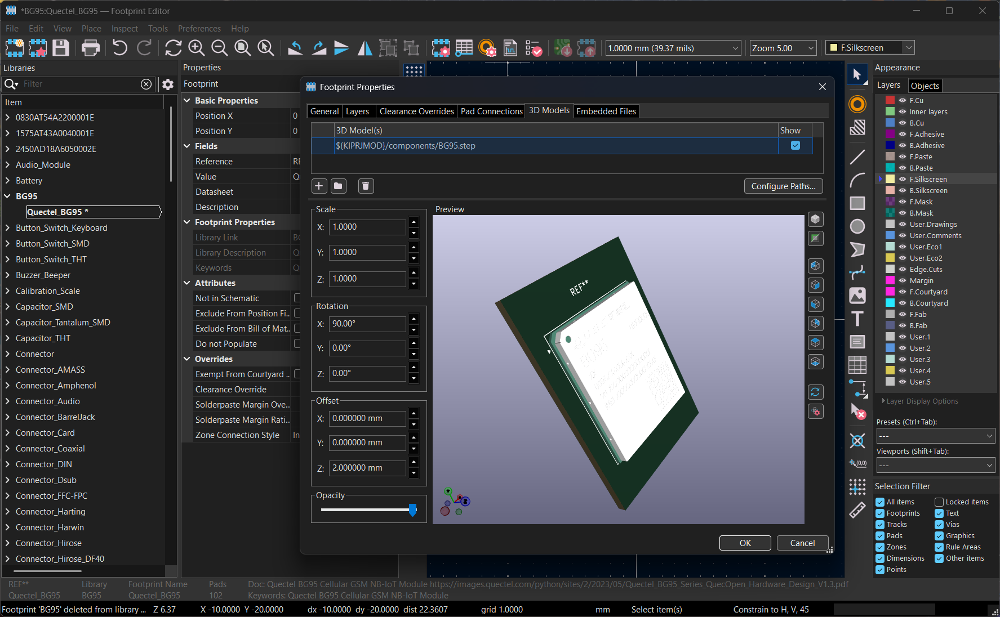

now, with that settled i can finally get to work on the schematic yayyyy

### the antennas:

for this i'll be using the bluetooth and main (LTE) antenna (even though the BG95-MF has wifi capabilities)

TBC

### connecting it to the MCU

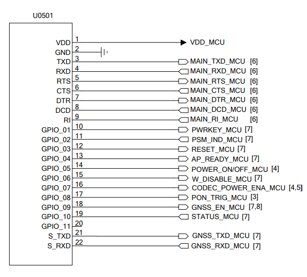

TBC

note: i realized it was 11:57 and forgot to push, clutched in under 2 mins saving my streak!!!

### the micro SIM card

continued configuring the MCU 

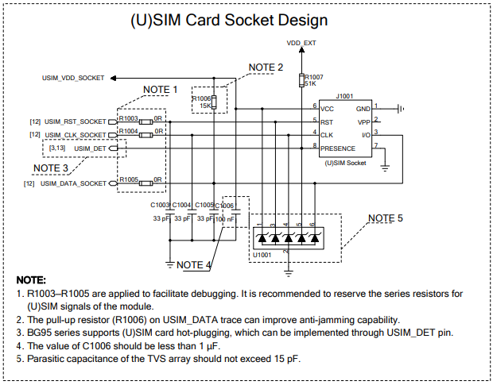

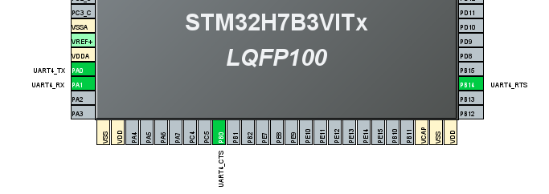

TBC

**total time spent: 2.5 hours** 

# september 10: deciding on which pins to breakout and making a BOM

remembered that instead of wracking my brain trying to figure out what pins go where i should just settle the breakouts first... eheh ;>

and in order to do that i should probably make a proper BOM

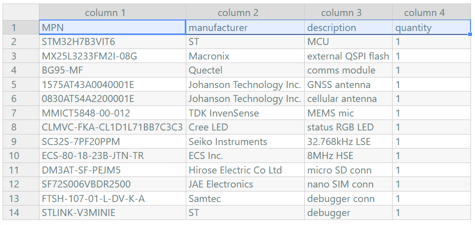

## breakouts

now that that's done it's time to go over how to wire up the components

the clocks take 2 pins each, here they are `PC14-OSC32_IN` and `PC15-OSC32_OUT` for the LSE, and `PH0-OSC_IN` and `PH1-OSC_OUT` for the HSE

the DCMI interface (unshockingly) use a whole lot of pins: (slave 8 bits external sync)

1. `PA4-DCMI_HSYNC`
2. `PA6-DCMI_PIXCLK`
3. `PA9-DCMI_D0`
4. `PB7-DCMI_VSYNC`
5. `PB13-DCMI_D2`
6. `PC7-DCMI_D1`
7. `PC9-DCMI_D3`
8. `PD3-DCMI_D5`
9. `PE4-DCMI_D4`
10. `PE5-DCMI_D6`
11. `PE6-DCMI_D7`

i'm choosing to directly drive the SD card via SDMMC instead of SPI

1. `PB13-SDMMC1_D0`
2. `PC9-SDMMC1_D1`
3. `PC10-SDMMC1_D2`
4. `PC11-SDMMC1_D3`
5. `PC12-SDMMC1_CK`
6. `PD2-SDMMC1_CMD`

the BG95MFLA-64-SGNS uses
2 UARTs, one with CTS/RTS hardware flow control and one without for the cellular and GNSS respectively as well as 10 GPIOs for other features

the cellular UART

1. `PE7-UART7_RX`
2. `PE8-UART7_TX`
3. `PE9-UART7_RTS`
4. `PE10-UART7_CTS`

the GNSS UART

1. `PB6-UART5_TX`
2. `PB12-UART5_RX`

TBC

note: paused lapse for 20 mins AND forgot to push. welp.

**total time spent: 1 hour**

# september 11: time to lock in for the schematic!!!

note: for anyone that has to review this or anything if i pause for a while i'm most likely reviewing schematics on a second monitor (excluding the ones on this laptop)

so to start i'm going to just undo all the organization and turn the schematic into one large page and reorganize them later


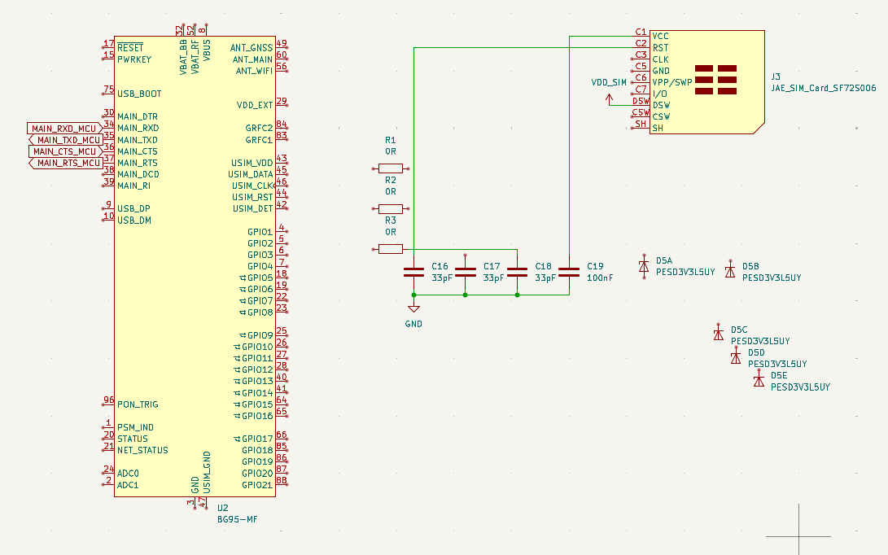

i have no idea what i did here so i'm redoing that

first, according to the reference design

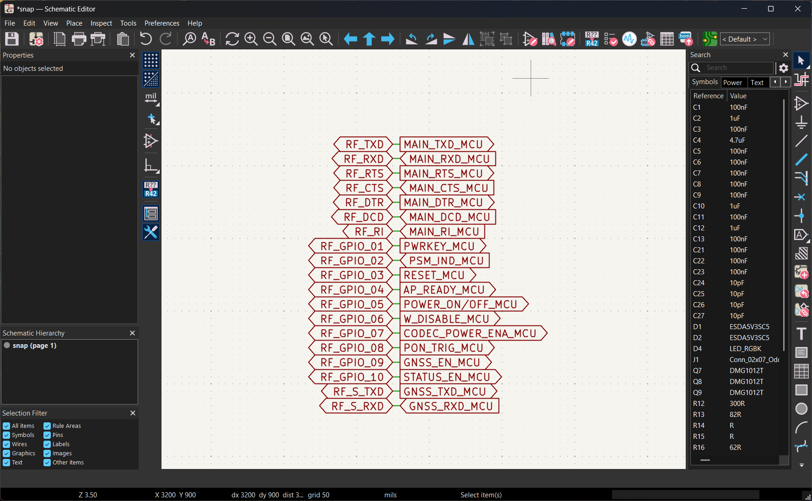

i did this to simplify figuring out which pins to breakout later and where, right now i'm treating this like i'm literally making a eval module with all the necessary protections

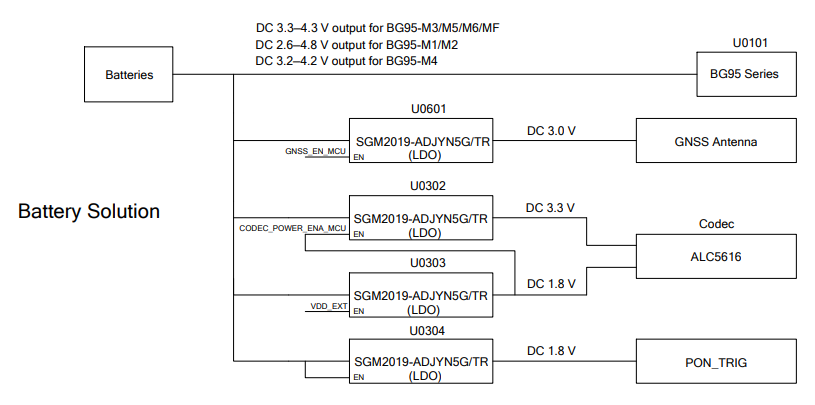

since i'm using a battery and the BG95-MF in particular i'll have to power the module at 4V even though its minimum is 3.3V (same as the MCU)

now it recommends the SGM2019-ADJYN5G/TR LDO but we're going to replace it directly with the [SGM2036S-ADJXN5G/TR](https://www.sg-micro.com/rect/assets/17ec502a-e4c4-4cc4-8df9-77986a7c65af/SGM2036S.pdf?access_token=JB0xlRQ-10F_vQg1XXqsnx8zy4iF65LO) with the exact same footprint 

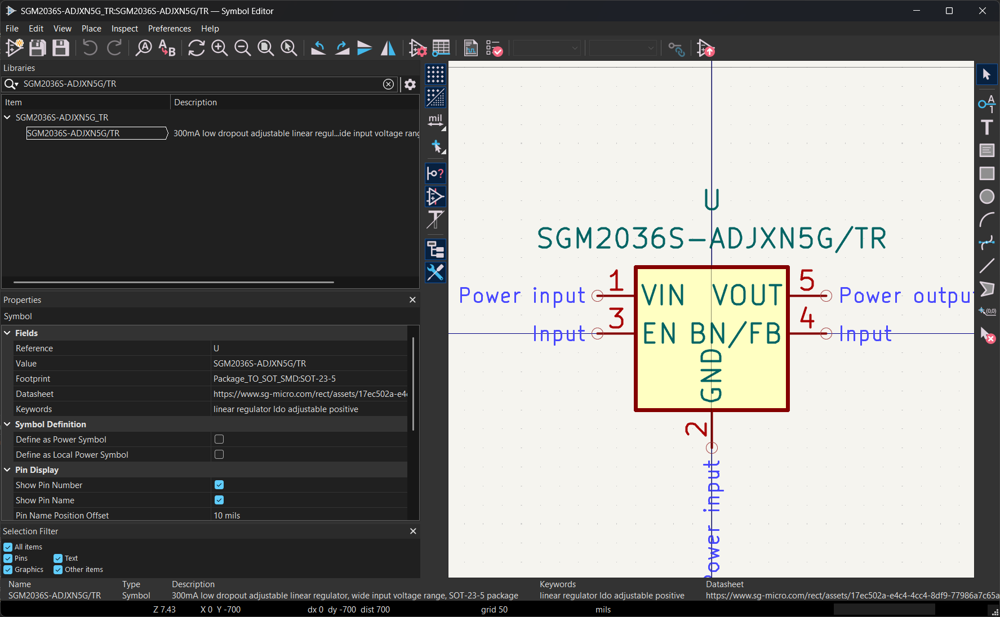

edited the AP2204K-ADJ in the kicad symbol lib and made a copy with a new symbol name and changed the name of one of the pins to match the SGM2036S-ADJXN5G/TR

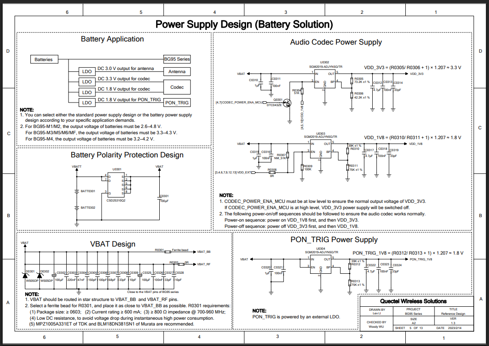

i'm going to be excluding the ALC5616 audio codec power supply because it's going to be storing the audio on the SD card and not being used for calls and stuff

this one's a more detailed view of the power supply design with batteries

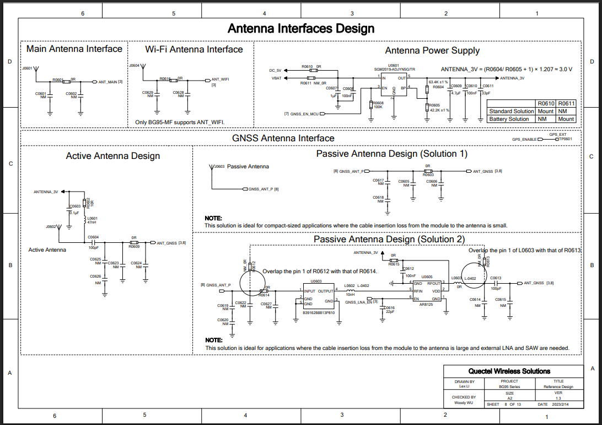

and here i'm excluding the wifi antenna interface and using an active antenna design for the GNSS antenna

for a second i got confused as to why chip antennas have 2 pins then i realized one's just supposed to be left floating and is mainly for mechanical support (iirc)

and i learned that NM stands for not mounted

on the antenna power supply section you might notice that there are seemingly 2 power supplies: `DC_5V` and `VBAT`, they're actually just there to signify how to power it depending on if you're using batteries or a dc pwr supply for it, hence the `NF_0R`

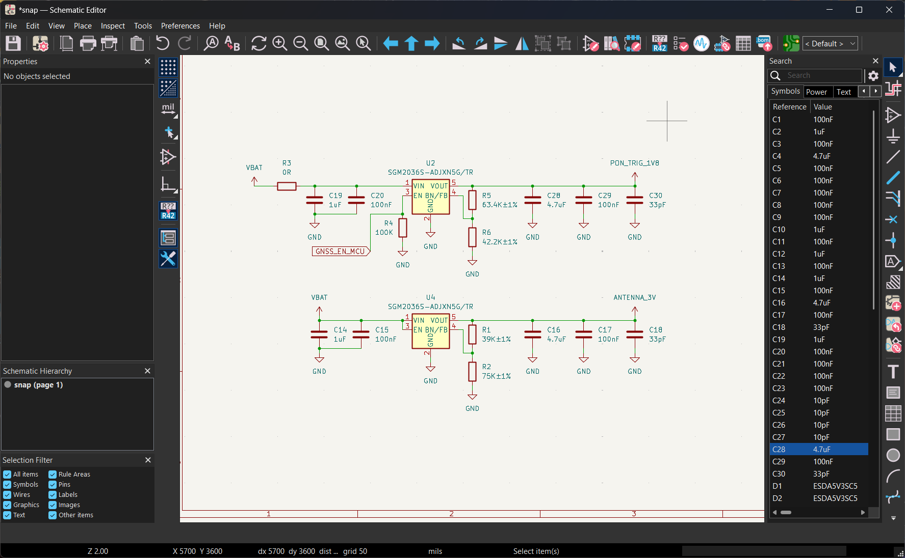

also stealing from the CSD25302Q2 symbol in the kicad lib with the same footprint following the same steps as the AP2204K-ADJ

for the pwr supply decoupling caps, since the WS05DP isn't in production anymore, i'm using the ESD9B5.0ST5G as an alternative to them

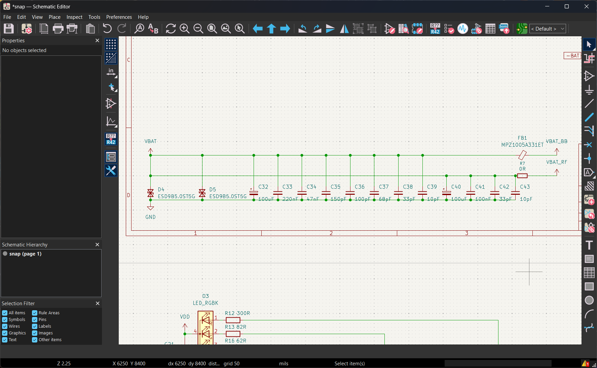

next, for the UART level shifters:

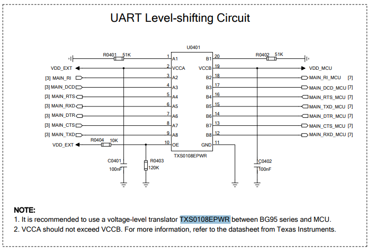

the reference design recommends using the TXS0108EPWR with 8 channels for the main UART, but says nothing much about the GNSS UART level shifter, only that both UART level shifters are 1.8 - 3.3V, so i asked for advice in the hc `#hardware`

"i'm making a schematic that involves level shifting and my reference design uses a TXS0108EPWR with 8 channels. i need to add 2 more channels to support another one of my components and both of the level shifters are 1.8 - 3.3V, but should i use the recommended component with another level shifter with 2 channels or merge them and use a level shifter with 10 channels?" - me

while waiting for advice i'm going to be doing the antennas first

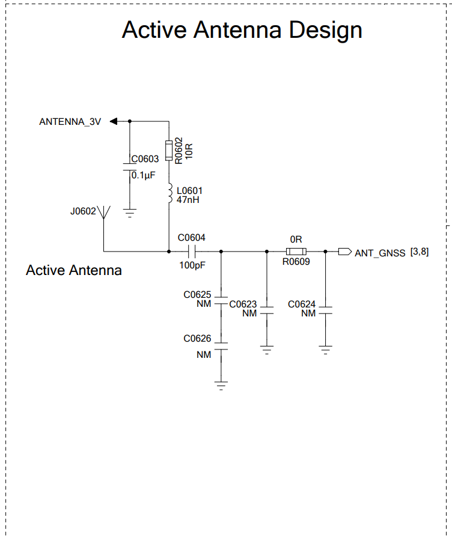

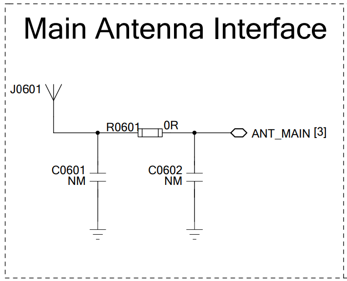

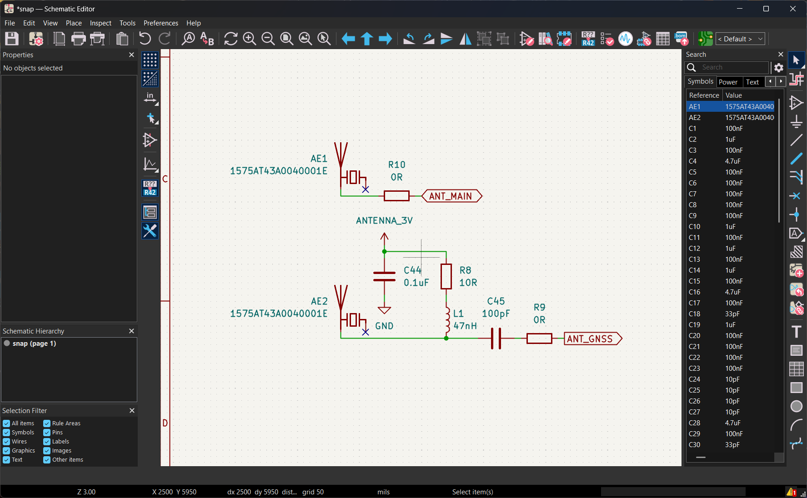

moving on, adding 2 status LEDs:

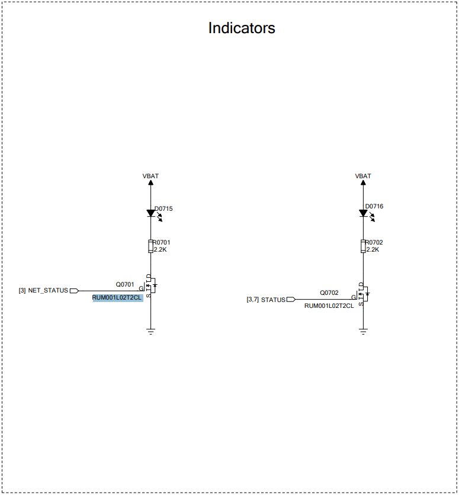

it calls for the RUM001L02T2CL, but i'm substituting them for 2x DMG1012T-7 transistors because i already use them for the RGB LED

also realized i forgot to add the CLMVC-FKA-CL1D1L71BB7C3C3 as the component value for the RGB LED

TBC!!!

**total time spent: 4 hours**

# september 12: time to lock in for the schematic!!! (continued)

note: back after pushing, NOT SLEEPING TONIGHT RAAAAAAWR

back to that bit about the status LED, the HB-CLM3A-BKW-GKW LEDs don't exactly have a matching footprint or a standard footprint in the kicad footprint lib, so i'm using the `LED_PLCC-2_3x2mm_AK` footprint. note that this is the `AK` variant and not the `KA` variant, 

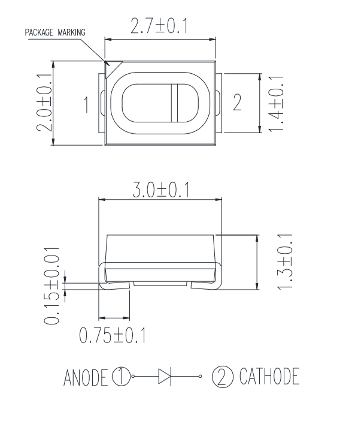

as specified by the diagram here

and i got confused by which one would connect which way lol

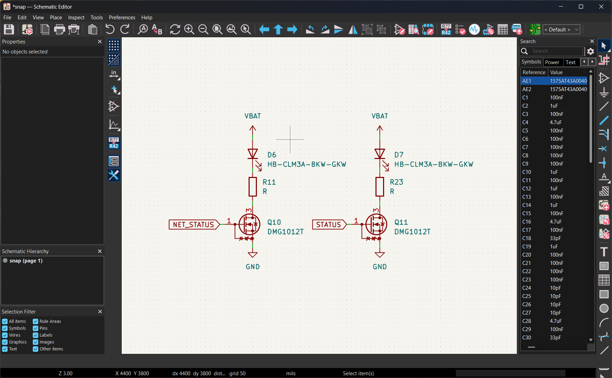

time to get to work on the SIM card connector, which i'm just realizing was one of the things i deleted but oh well it wasn't finished anyways

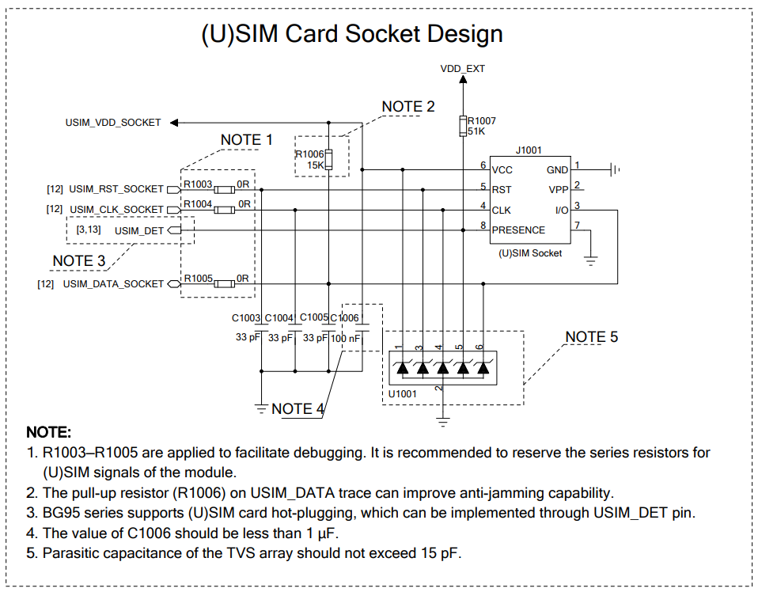

the symbol `JAE_SIM_Card_SF72S006` specifies shielding and the card detection switch is open by default, so i'm wiring both `CSW` and `SH` to ground

in the schematic section i deleted i used the PESD3V3LSUY but apparently i didn't notice that the reference design specifies that the esd array's parasitic capacitance shouldn't exceed 15pF, which the PESD3V3LSUY exceeds at a typical 22pF so its time to look for another

i'm going to be using the TPD5E003DPFR instead, with the `WSON-6-1EP_3x3mm_P0.95mm` footprint (had to make sure that their dimensions were compatible)

i made a copy of the `PESD3V3L5UY` symbol and edited it to be connected to the `WSON-6-1EP_3x3mm_P0.95mm` footprint, fortunately both have pin 2 as ground and the rest as their respective pins

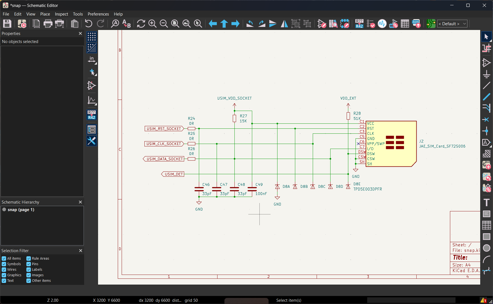

checking the connections took a while lol trying to make sure everything was connected to the right caps and pins

now for the mcu interface bit, 


this section (mentioned above somewhere) is actually also part of the reference design hehe

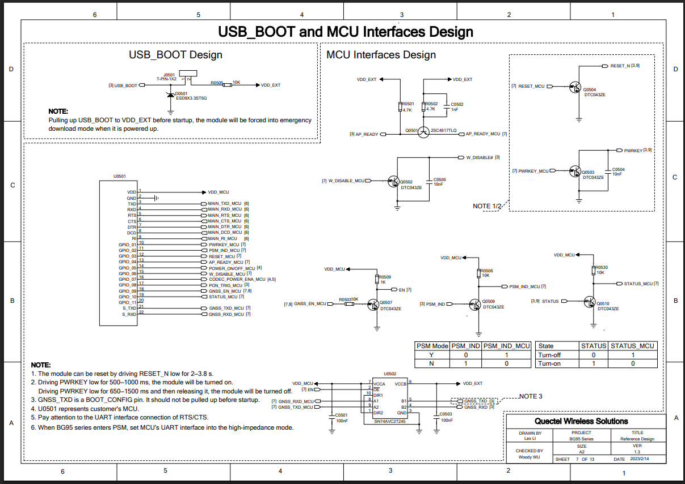

the schematic calls for the DTC043ZE, but i'm using the [DTC143Z](https://fscdn.rohm.com/en/products/databook/datasheet/discrete/transistor/digital/dtc143ze3-e.pdf) (specifically the SMD one from ROHM and not the THT one from onsemi) cos it has a symbol in kicad and

annoyed note: i have been trying to find resources to understand SOT dimensions for a solid maybe 20 mins. i know what a SOT-23 is, it's available as a footprint in kicad, but what on earth is a SOT-723

so. apparently for the DTC143Z, the footprint sizes that appear in the footprint dropdown when you add a symbol to a schematic are NOT COMPREHENSIVE. I HAVE SUCCESSFULLY WALKED IN CIRCLES FOR IDK HOW LONG.

ahem

anyways

i'll be using the DTC143ZEB as a drop in replacement for the DTC043E, with the `SOT-416` footprint in the kicad footprint library (even though the component itself uses a SOT-416FL footprint i'm just hoping it works out)

HOLY ELITE PULL

i found this [website](https://blog.mbedded.ninja/pcb-design/component-packages/sot-416-component-package/) with tons of resources for embedded devices!!! (why didn't i find it earlier TwT) 

note to reader: PLEASE HAVE A LOOK AT THE WEBSITE TRUST ME ITS PEAK

anyways according to it the land pattern dimensions are slightly different... and i just realized i can use the other version with gullwing leads that match the kicad footprint 

so now i'm using the DTC143ZE3  (sung to the tune of the chorus of payphone by maroon 5)

as well as the 2SC4617TLQ with a generic npn transistor symbol which also uses an `SOT-416` footprint

ok i can finally get back to stealing the reference design hehe >:3c

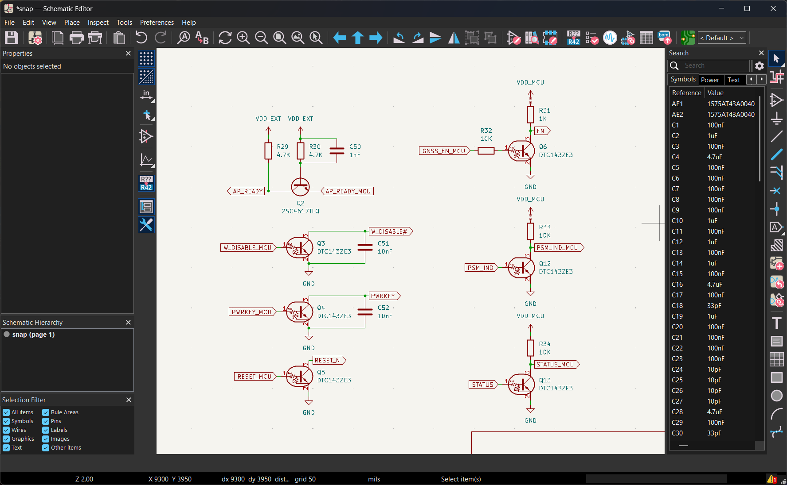

i just realized the GNSS UART level shifter i was looking for is apparently at the bottom using a SN74AVC2T245RSWR

hm.

i should learn to check the entire .pdf before saying something's missing.

anyways the SN74AVC2T245RSWR uses a 10-UQFN (1.8x1.4) footprint available in kicad as `UQFN-10_1.4x1.8mm_P0.4mm`

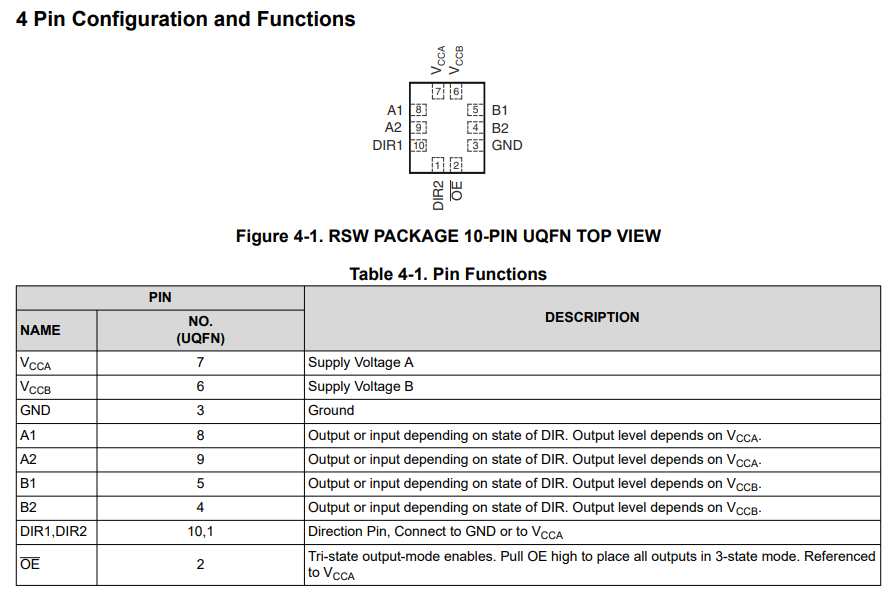

it doesn't have a symbol in the kicad symbol lib, so i had to make one by stealing from the SN74AVC4T245PW symbol and adapting it to the pins

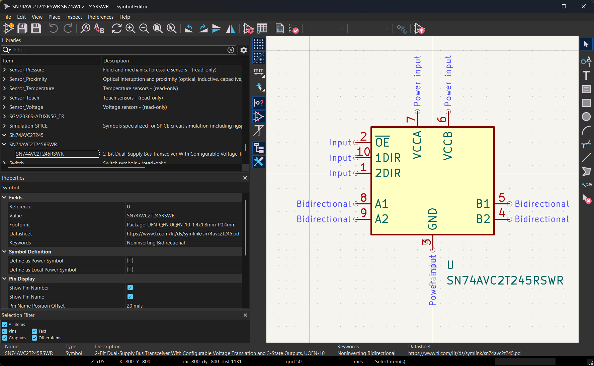

and also since i don't need my previous question answered anymore, i can finally finish the main UART level shifter

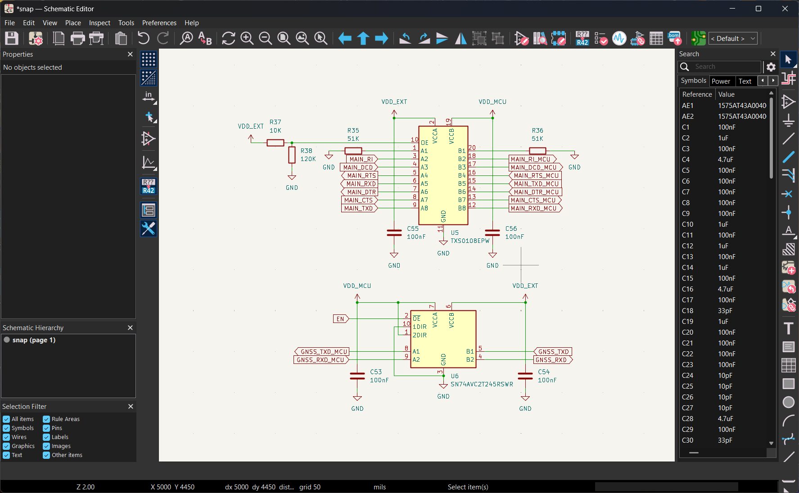

also realized that the the GNSS active antenna and PON_TRIG power supplies had `ANTENNA_3V` and `PON_TRIG_1V8` switched lol

next for the module interface design where we shove everything together:

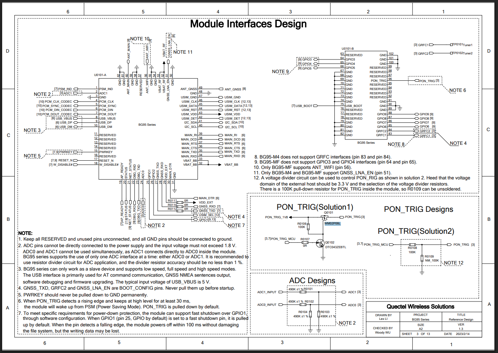

i'm going to be excluding a whole lot of pins for stuff i'm not using 

so according to the reference design, there are 2 ways to power the PON_TRIG pin, depending on if your MCU outputs 3.3V directly, and i almost tried to do some really unnecessary stuff (aka. solution 1 with a weird ass transistor)

i'm using solution 2 (powering it directly with the MCU's 3.3V output)

also i forgot to do the analog switch so i'm doing that bit now

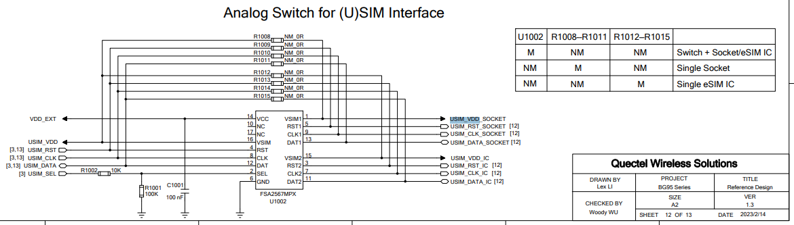

the analog switch uses a [FSA2567MPX](https://www.onsemi.com/pdf/datasheet/fsa2567-d.pdf) with a `UQFN-16-1EP_3x3mm_P0.5mm_EP1.75x1.75mm` footprint (no symbol though, had to refer to the datasheet's pin assignments and make one from scratch, also i got lazy and copied the reference design one instead of the fancy datasheet one)

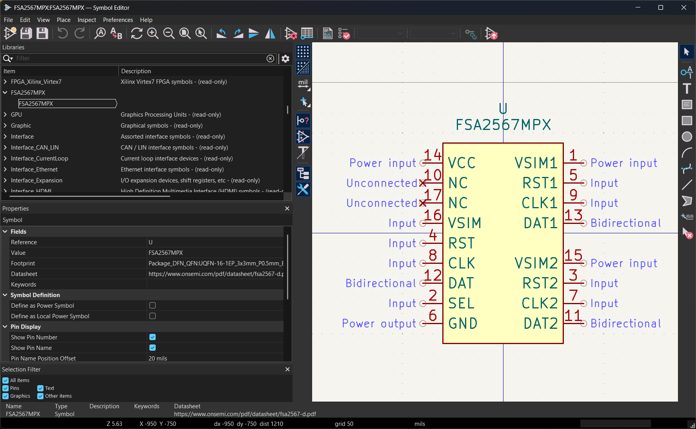

i just realized that i don't need one.

apparently because i'm only using one USIM and no ESIM the only thing i have to do is wire them directly. adding the analog switch and following the instructions in the table on what 0R resistors to add in this case wire sel to gnd and remove the esim entirely, making the analog switch absolutely USELESS.

hm.

welp at least i have its symbol if i need to use it next time

now back to the whole connecting everything back to the RF module again,

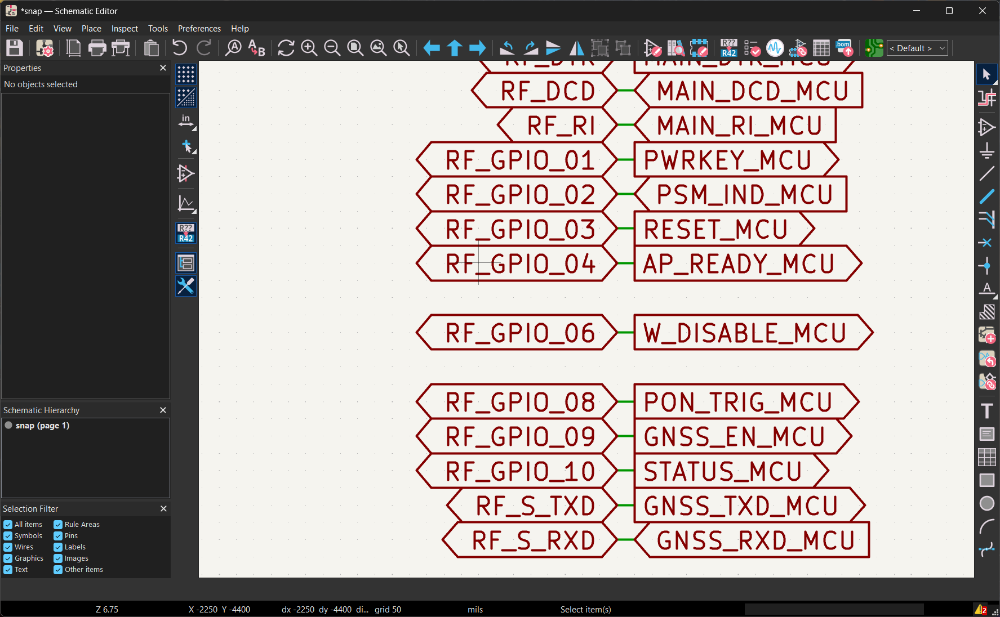
i realized that 2 of the pins were unnecessary: `POWER_ON/OFF_MCU` and `CODEC_POWER_ENA_MCU` so i removed them

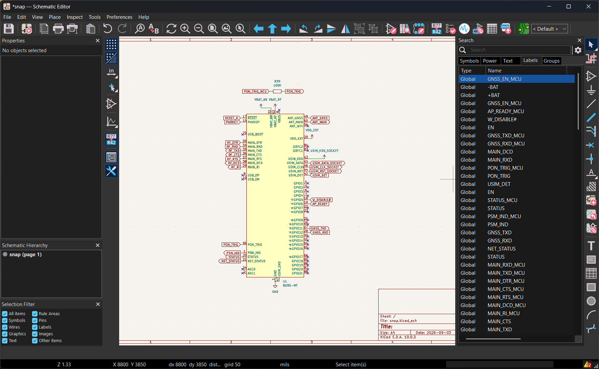

now all the stuff for the RF module specifically should be done!!! :>

i still won't be organizing them yet tho

now i have to make the camera module!

time to do a lil research on what DCMI is and how to make camera modules for it... i kinda want to do something similar to how openMV did theirs clipping and screwing straight onto the main board

also noticed that i used the wrong component for the main antenna lol, fixed it right after

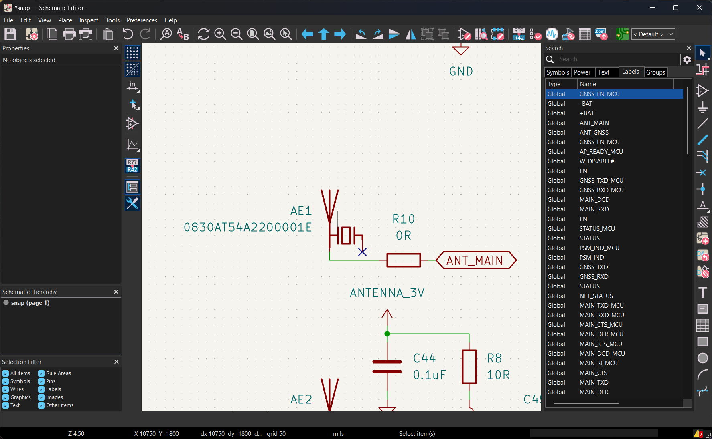

RESEARCH TIME RAWRRR

soooooooo in the august 29 entry i said some stuff about autofocus and mv... i also feel like getting a wide FOV because well the more stuff saved the better 

i've found a sensor that looks to be pretty useful: the IMX708 (with a 120deg fov lens) now the thing is, why is there ZERO documentation on the sensors or the camera modules (not the PCBs the literal modules the ones with the sensor and lens)

FAAAAHHHHHHHH.sfx

so apparently most camera modules online don't come with datasheets specifically because the manufacturers don't release them to the public, and when they do release them, they hand it to companies under NDAs

well that sucks

now i have 2 options: continue scouring for something on forums and build my own or use one of openMV's cameras

lemme ask #hardware on hc slack

THERE'S LITERALLY NOTHING. except for onsemi which does make image sensors but not modules (the very fact that they have free docs is surprising)

welp i give up. adding the openmv camera module to the BOM later :< hey at least their customer support's quick, replied to my email in 10 mins

now on getting it connectable to the main board, the openMV cams all use a slightly outdated connector: the DF12(3.0)-36DP-0.5V(86) header and DF12A-36DS-0.5V(81) receptacle (but tbh it looks like it should be the other way based on their shape)

the manufacturer (hirose) offers a new almost identical set of components as a drop in replacement: the DF12NB(3.0)-36DP-0.5V(51) header and the DF12NB(3.0)-36DS-0.5V(51) receptacle

according to [this datasheet](https://www.hirose.com/en/product/document?clcode=&productname=&series=DF12N&documenttype=Catalog&lang=en&documentid=ed_DF12N_20200819) (for the new parts btw) there are 2 main variants: the DF12NB with solder tabs and the DF12NC without and kicad happens to only have footprints for the DF12NC

so for the symbol i'll use the `Conn_02x18_Odd_Even_MountingPin` symbol and as for the footprint i'll edit the existing one in kicad and just add the solder tabs

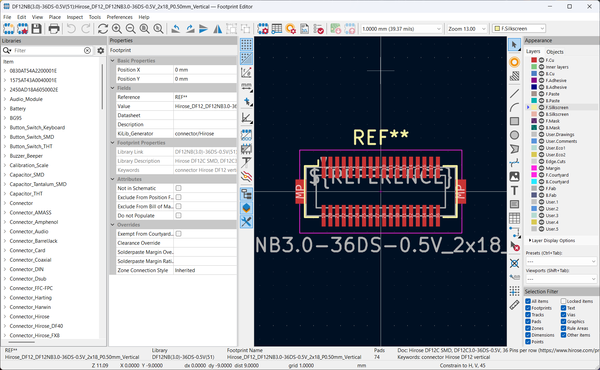

it came with a manufacturer provided 3D model too!

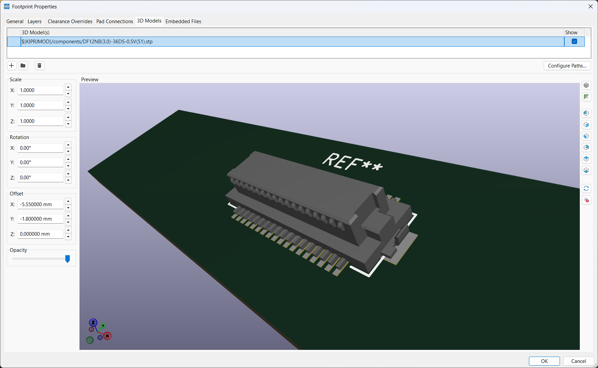

stealing the openMV cam H7's schematics so this board can be compatible,

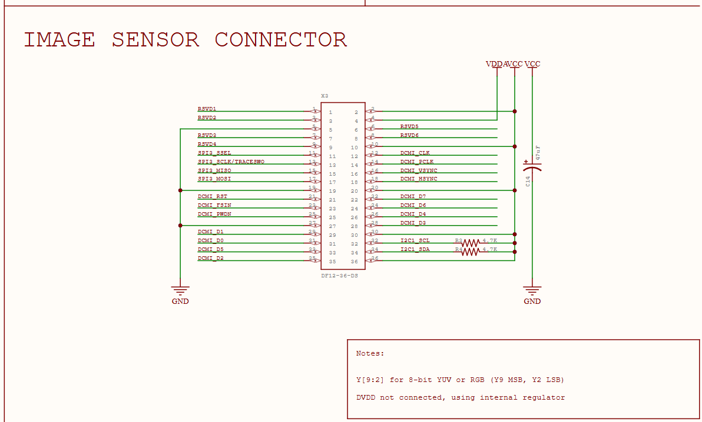

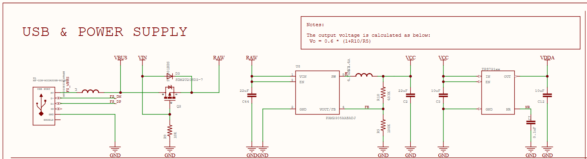

thanks to me from a couple entries ago,

note: the following will not be about cameras AT ALL instead i will attempt to figure out how to wire everything to the MCU

> the DCMI interface (unshockingly) use a whole lot of pins: (slave 8 bits external sync)
> 
> 1. `PA4-DCMI_HSYNC`
> 2. `PA6-DCMI_PIXCLK`
> 3. `PA9-DCMI_D0`
> 4. `PB7-DCMI_VSYNC`
> 5. `PB13-DCMI_D2`
> 6. `PC7-DCMI_D1`
> 7. `PC9-DCMI_D3`
> 8. `PD3-DCMI_D5`
> 9. `PE4-DCMI_D4`
> 10. `PE5-DCMI_D6`
> 11. `PE6-DCMI_D7`

comparing the current pins to the H7's it seems i'm missing a bunch of pins, specifically the `DCMI_CLK`, `DCMI_FSIN`, and `DCMI_PWDN` pins as well as a set of SPI and I2C pins

after adding the SPI and I2C pins, i now have the additional:

1. `PA11-SPI2_NSS`
2. `PB10-SPI2_SCK`
3. `PC1-SPI2_MOSI`
4. `PC2_C-SPI2_MISO`
5. `PB10-12C2_SCL`
6. `PB11-2C2_SDA`

going back over the components on this board, 
there are the following,

for the camera conn:

 - 1x DCMI (Slave 8 bits External Synchro)
 - 1x I2C (I2C)
 - 1x SPI (Full Duplex Master)

for the RF module:

 - 2x UART (Asynchronous, CTS/RTS) and (Asynchronous)
 - 8x GPIO

for the mic:

 - 1x I2S (Half Duplex Master)

for the RGB status LED:
 - 3x GPIO

for the external flash memory:

 - 1x OCTOSPI (Quad SPI)

for the clocks:

- 1x RCC_OSC32
- 1x RCC_OSC

for the debugger conn:

 - 1x Debug (JTAG 5 pins)
 - 1x UART (Asynchronous)

TBC

**total time spent: 10 hours**