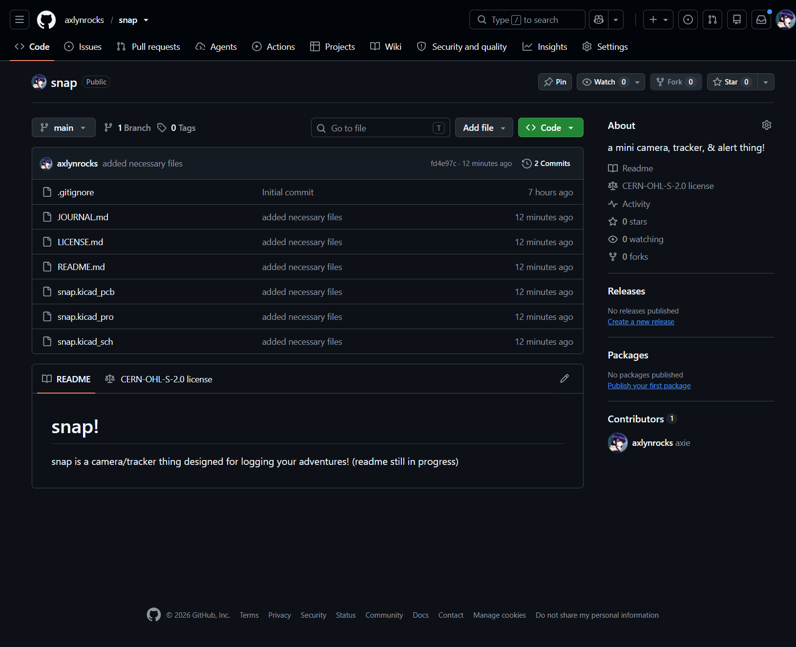
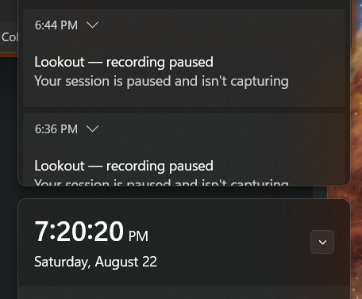
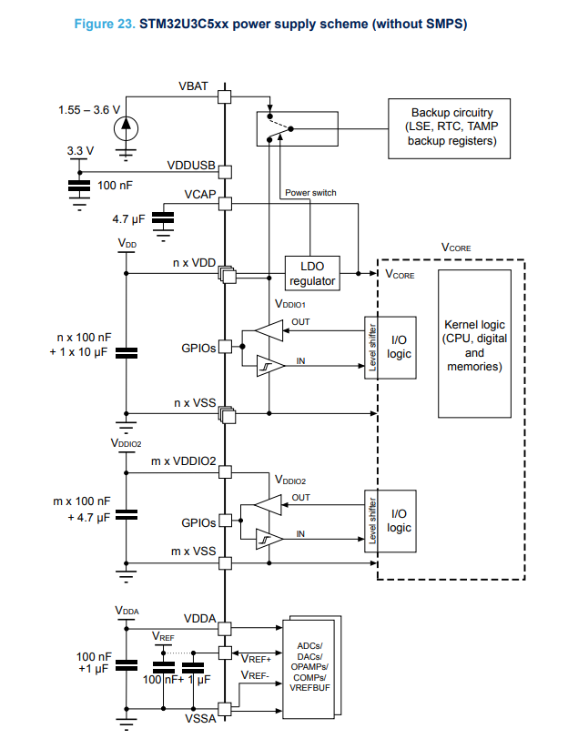
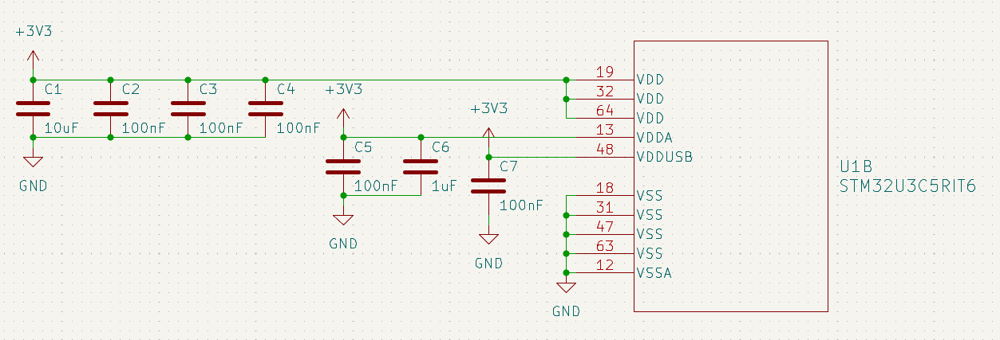
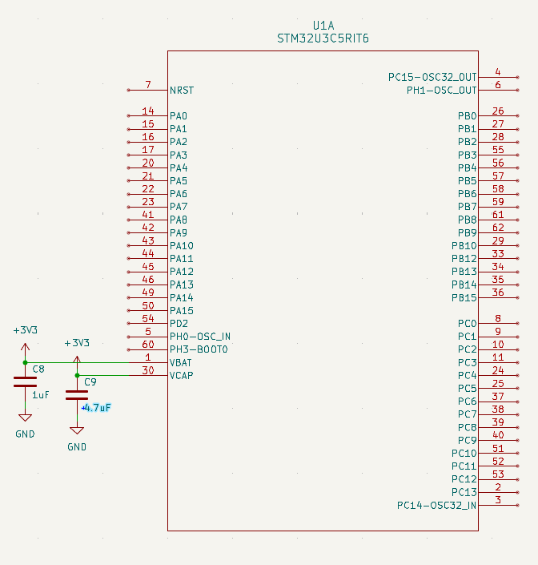
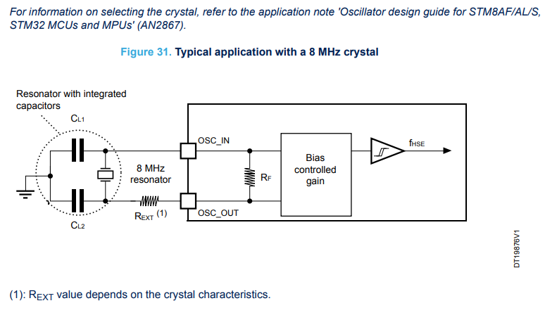
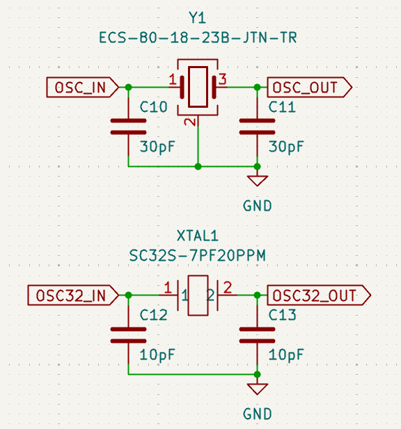

# august 21: got started and ...
started with making the README as all half-baked projects do and added the CERN-OHL to it :>

decided to research what i wanted to put in this (i.e. the features) and came up with a few things:
 - a push-to-talk mic for making voice memos
 - secondary SD card storage (also i just learned that UHS-II microSD cards exist)
 - periodic GPS
 - a camera (hence the name)
 - BLE positioning
 - a dot matrix display
 - replaceable battery packs

so far, the important parts i've mostly settled on are:
1. mic: SPG08P4HM4H-1
2. sd card connector: a DM3AT-SF-PEJM5 for microSD
3. gps:
    - chip antenna: 1575AT43A0040001E
    - modem: LC76GABMD (according to its datasheet it doesnt use much power)
4. camera: (on hold for now until i figure out whether i can use a module or i have to design one from scratch)

i'll figure the rest of the features out as i go along lol

i'm planning to also design (and hopefully 3D print) a couple of different enclosures to keep it attached on bag straps or on other stuff! still trying to think about how to solve the issue of this stuff not being used in *questionable* ways... 

for some of the features above dealing with sensitive data i could add data encryption but thats a story for another time

**total time spent: 2.5 hours**

# august 22: started work on the microcontroller!
started off looking up what microcontroller i should use,
some stuff that contributed to my final decision were
 - how power intensive it is
 - if it has enough gpios for all the features
 - cryptography support!!! (wouldn't want *questionable* things to happen to the recordings so i should be encrypting user data)

so i eventually decided on the STM32U3C5RI cos it checks off all the criteria listed above! i started reading stuff on it to understand what i was working with (datasheets, guides, random oddly helpful reddit posts, etc.)

unrelated, but i just realized i paused lookout for about 30 mins without noticing :/

i'm thinking of adding extra flash on top of the MCU's inbuilt stuff
i'll be referring to this tutorial [here](https://roboticworx.io/blogs/projects/build-custom-stm32s-from-scratch-tutorial) for some of the stuff (no i'm not going to copy it 1 to 1 relaaaaaaxxxxxxx)

i'm probably not going to add an onboard STlink debugger (yet)

so far i've learned about what goes into a devboard so i'll have to connect 
 - a voltage regulator (the MCU runs on 3.3V)
 - external OCTOSPI

**total time spent: 4.5 hours**

# august 23: schematics pt.1
note that this is chronologically immediately after the previous journal entry i just wanted to break them in two it is currently 12am something as of writing this

anyways b a c k to the journal entry!

ok here goes nothing i'm going to actually start making the wait can i just call this a glorified devboard bit (MCU, power regulator, flash, crystal - yknow the basic bits)

unrelated note: fell asleep at 1am here, woke up at 6 something

according to its [datasheet](https://www.st.com/resource/en/datasheet/stm32u3c5ci.pdf) (chapter 7, ordering info), the STM32U3C5RIT6 has 64 pins, comes in a LQFP (low-profile quad flat package), can stand temperatures of -40C to 85C, and does NOT have an SMPS (saving me the GPIOs and time cos this isn't an application where i'd need to optimize every mW)

also going to refer to [this](https://www.st.com/resource/en/application_note/an6011-getting-started-with-stm32u3-mcu-hardware-development-stmicroelectronics.pdf), specifically chapter 8, reference design, figure 13

got slightly carried away and switched the journal images from being hosted on github's user attachments to a local directory (`journal_images` in case you're looking for it)

i'm going to start off with this schematic (chapter 5, electrical characteristics, figure 23), showing what capacitors go where for its power supply specifically for the models without an SMPS

**it** happened again. 15 long minutes of not recording. TwT

also, note to self, make sure to check the contents of your commit before pushing to the repo blindly to avoid a 20min long headache fixing broken symbol and footprint paths

anyways following this, i did this (btw VDDIO and VREF in figure 23 don't apply for the STM32U3C5RIT6 cos it doesn't have those pins) to complete the power decoupling caps!

 

next i looked at adding an oscillator to it, following (chapter 5, electrical characteristics, figure 23), 

[the application note](https://www.st.com/resource/en/application_note/an2867-guidelines-for-oscillator-design-on-stm8afals-and-stm32-mcusmpus-stmicroelectronics.pdf)

i used an ECS-80-18-23B-JTN-TR 8MHz crystal for the oscillator and a SC32S-7PF20PPM 32.768kHz crystal for the LSE following the tutorial cos i didnt see a reason to change it

now this part's a little bit tricky: i have to decide what pins in particular i'm going to need to breakout, so that means returning to the feature list!!!

i'm going to stop here for now lol while i figure out the features, protocols, pins and stuff

**total time spent: 6.25 hours**